<div align="center">

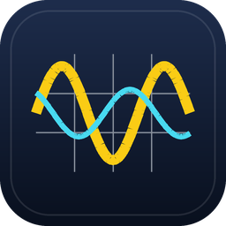

# ECE Tool Suite

**One window for the whole bench.** Real instruments over SCPI, power stages verified in SPICE,
RTL graded by the open-source toolchain, and nothing ever labelled a measurement until the
hardware says so.

[](https://github.com/karimrayttu/ece-tool-suite/actions/workflows/ci.yml)
[](LICENSE)
[](https://www.python.org/)
[](https://nodejs.org/)
[](#platform-support)
[](CONTRIBUTING.md)

[Quick start](#quick-start) · [Screenshots](#the-bench) · [Documentation](#more-documentation) ·
[Contributing](#contributing) · [Releases](https://github.com/karimrayttu/ece-tool-suite/releases)

</div>


---

## At a glance

| | |
|---|---|
| **Instruments** | Oscilloscope, multimeter, spectrum analyzer, power supply, function generator, electronic load. USB, LAN, serial, GPIB. 19 vendors recognised from `*IDN?`. |
| **Never lies about data** | Every reading is tagged `SIMULATED`, `UNVERIFIED_HW` or `VERIFIED_HW`. The tag can be lowered, never raised. Promotion needs a live `*IDN?` and a clean error queue. |
| **Safe sourcing** | No output turns on without a declared DUT envelope, protective limits written *and read back*, and your explicit confirm. Any failure rolls back with the output off. |
| **Power design** | Buck and boost sizing, then verified by actually running the netlist through LTspice or ngspice. Loop margins, magnetics, cap banks, 20 calculators. |
| **Digital** | Verilog, SystemVerilog and VHDL through Icarus, Verilator, GHDL, Yosys and nextpnr. SPI, I²C, UART and CAN decode. MCU flashing over UPDI. |
| **Design glue** | Parts search with distributor link import, KiCad schematic analysis, CubeMX `.ioc` editing, LabVIEW automation. |
| **Agent-ready** | Built-in assistant plus an MCP server, with a tool surface that is a strict subset of the app's and cannot energize anything. |

---

## Quick start

You need **Python 3.12+** and **Node 18+**. No instrument required.

```bash
git clone https://github.com/karimrayttu/ece-tool-suite.git
cd ece-tool-suite
powershell -ExecutionPolicy Bypass -File scripts\setup.ps1   # macOS/Linux: ./scripts/setup.sh
npm run app
```

That is the whole install. The setup script builds the Python environment and installs the JS
dependencies; `npm run app` opens the native window and starts the backend itself.

Confirm it works with `npm test`. Expect **328 passed, 1 skipped** on a full install, or a green
run with more skips if you took the `-Minimal` option. Full detail in
[Installation](#installation).

---

## Contents

- [At a glance](#at-a-glance)
- [Quick start](#quick-start)
- [What it is](#what-it-is)
- [Requirements](#requirements)
- [Installation](#installation)
- [Running it](#running-it)
- [Step by step: your first measurement](#step-by-step-your-first-measurement)
- [The bench](#the-bench)
- [Design tools](#design-tools)
- [Digital and embedded](#digital-and-embedded)
- [Automation and integrations](#automation-and-integrations)
- [Configuration](#configuration)
- [Troubleshooting](#troubleshooting)
- [Platform support](#platform-support)
- [More documentation](#more-documentation)
- [Contributing](#contributing)
- [License](#license)
- [Trademarks](#trademarks)

---

## What it is

Bench work spreads across too many windows. The scope has its own utility, the supply has
another, the SPICE run is somewhere else, and the numbers get copied between them by hand.
This started as a way to put a scope, a meter, a supply and a spectrum analyzer behind one
connection flow, and then kept growing into the design tools that surround them.

The thing I cared about most was that it never fabricates a measurement. Every reading carries
a tag saying where it came from, and the tag can only be lowered, never quietly raised:

| Tag | Meaning |
|---|---|
| `SIMULATED` | Produced by an instrument model, not by hardware |
| `UNVERIFIED_HW` | A real session is open, but nothing has confirmed what is on the other end |
| `VERIFIED_HW` | A live `*IDN?` and a clean error-queue read-back both passed |

That tag rides with the data into the UI, the WebSocket streams, the audit log, and every tool
result handed to an agent. `provenance.py` refuses to construct a reading without one, and
refuses to raise one. There is no software path to `VERIFIED_HW`; it takes an instrument.

---

## Requirements

| | Minimum | Notes |
|---|---|---|
| Python | 3.12 | 3.13 works too |
| Node | 18 | 20 is what CI uses |
| OS | Windows 10 or 11 | See [Platform support](#platform-support) |
| VISA | Optional | Needed only for USB instruments |

No instrument is required to install, run, or develop against the app.

---

## Installation

**1. Clone the repository.**

```bash
git clone https://github.com/karimrayttu/ece-tool-suite.git
cd ece-tool-suite
```

**2. Run the setup script.** It creates `backend/.venv`, installs the backend and its optional
extras, and runs `npm install` at the repo root.

```powershell
powershell -ExecutionPolicy Bypass -File scripts\setup.ps1
```

On macOS or Linux use `./scripts/setup.sh`. Either script accepts `-Minimal` / `--minimal` to
skip the optional extras; the app still runs, and the tabs that need them say what is missing
instead of failing.

**3. Check it worked.**

```bash
npm test
```

You should get `328 passed, 1 skipped`. The suite drives instrument models rather than
hardware, and every feature that shells out to a vendor tool (Yosys, Icarus, LTspice,
LabVIEWCLI, CubeMX) skips its tests when that tool is absent. On a machine with none of them
installed you get a green run with a lot of skips, which is the correct result.

---

## Running it

```bash
npm run app      # native Electron window; it starts the Python backend itself
npm run dev      # backend plus the Vite dev server at http://localhost:5173
npm run build    # rebuild the UI into apps/renderer/dist
npm run lint     # ruff over the backend
npm run smoke    # headless check that the packaged launch path works
```

`npm run app` is the normal way in. The Electron shell owns the backend's lifecycle: it picks a
free port starting at 8848, passes a per-launch token that `/health` has to echo back so it
never adopts a server it did not start, rebuilds the UI if it is stale, and kills the backend
on quit.

To build a Windows installer, see [docs/packaging.md](docs/packaging.md).

---

## Step by step: your first measurement

Every instrument tab has the same four-step connection bar. This is the whole flow.


**1. Open the tab for the role you want.** Oscilloscope, Multimeter, Spectrum or Sources. The
Connections tab above does all six at once if you prefer a single view.

**2. Find the instrument.** Press **Discover** to list the VISA resources visible over USB and
LAN, or type the address yourself:

| Interface | What to type |
|---|---|
| LAN, VXI-11 | `TCPIP0::192.168.0.50::inst0::INSTR` |
| LAN, HiSLIP | `TCPIP0::192.168.0.50::hislip0::INSTR` |
| LAN, raw socket | `TCPIP0::192.168.0.50::5025::SOCKET` |
| USB (USBTMC) | `USB0::0x2A8D::0x1234::MY51234567::INSTR` |
| Serial | `COM3` in the address box, or `ASRL3::INSTR` |
| GPIB | `GPIB0::22::INSTR` |

**3. Press Connect.** The session opens through the system VISA layer if one is installed, and
falls back to `pyvisa-py` if not. The badge now reads `UNVERIFIED_HW`.

**4. Press Verify.** This queries `*IDN?`, parses the vendor, model, serial and firmware, then
drains `:SYST:ERR?` until the queue reports empty. Both have to pass. A populated error queue
means the instrument rejected something, and a reading taken in that state is not trustworthy
even if a number came back. When both pass, the badge turns green and reads `VERIFIED_HW`.

Disconnecting destroys the session and the promotion with it. Reconnecting starts over at
`UNVERIFIED_HW`.

---

## The bench

### Oscilloscope

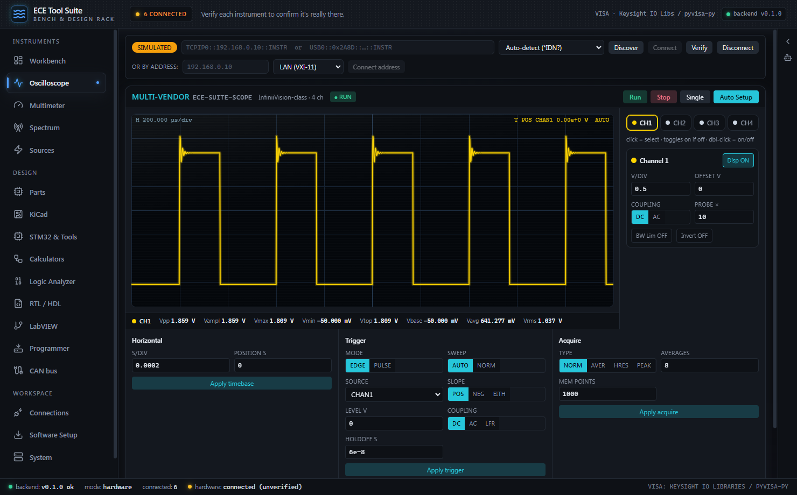

Four channels with V/div, offset, coupling and probe attenuation; timebase and trigger; Run,
Stop and Single. The measurement strip under the graticule carries Vpp, Vampl, Vmax, Vmin,
Vtop, Vbase, Vavg and Vrms, all read back from the instrument rather than computed in the
browser. Exports CSV, saves the canvas as PNG, and can pull a native screenshot off the scope.

**Auto Setup is bounded, never native.** The button runs identify, reset, verify, a bounded
autoset, then capture. It computes V/div and s/div from the expected signal and checks the
result against the scope's live front end. The instrument's own `:AUToScale` is refused in any
automated path, because it hands range selection to the instrument with no limit on what it
does to a 50 Ω front end.

### Multimeter

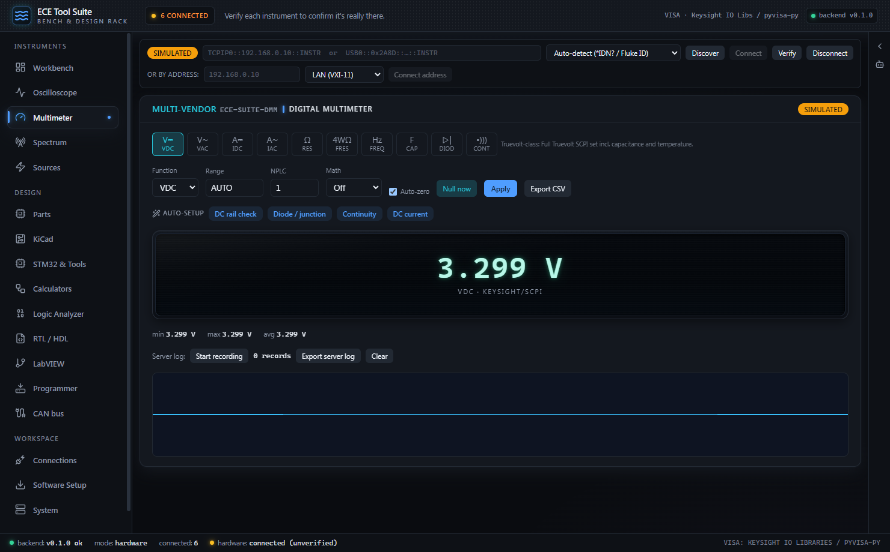

Eleven functions, range and NPLC control, math and auto-zero. The readout tracks min, max and
average alongside the live value. Client-side CSV export, plus a server-side recorder that logs
a session to disk and exports it as CSV.

### Spectrum analyzer

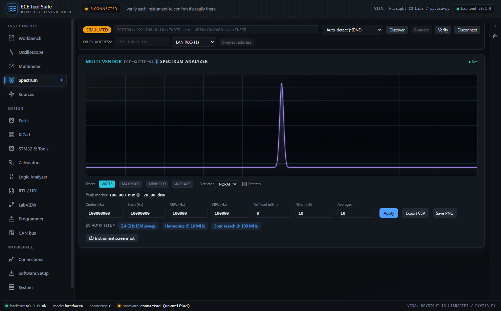

Centre, span, RBW, VBW, reference level, attenuation and averaging. Trace modes are write, max
hold, min hold, average and view, with detector and preamp controls. The peak marker reads out
under the grid, and there are one-press setups for an ISM sweep, a harmonics sweep and a spur
search.

### Sources, and the safety interlock

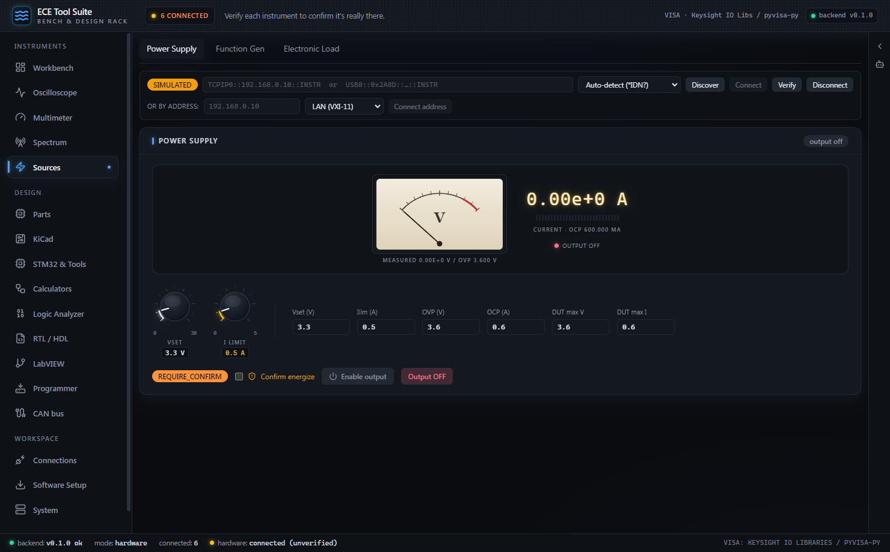

Power supply, function generator and electronic load. Before anything can be energized you
declare the DUT's maximum voltage and current. The verdict badge updates as you type.

An output turns on only when all four of these hold:

1. A DUT envelope is declared. There is no safe default, so its absence is a refusal.
2. The requested level sits inside both that envelope and the instrument's own rating.
3. The protective limits (OVP, OCP) were written and read back.
4. You ticked **Confirm energize**.

The runner rejects any plan where the enable step is not last or where protection is not set
first, then executes step by step: evaluate, write, drain the error queue, read the value back.
Any failure aborts with the output forced off. **Output OFF** is never gated.

### Workbench


Scope, meter and spectrum in one view, each with its own connection bar so you can bring up any
combination. **Auto-connect all** walks the discovered resources and binds them to roles.

---

## Design tools

### Power supply designer

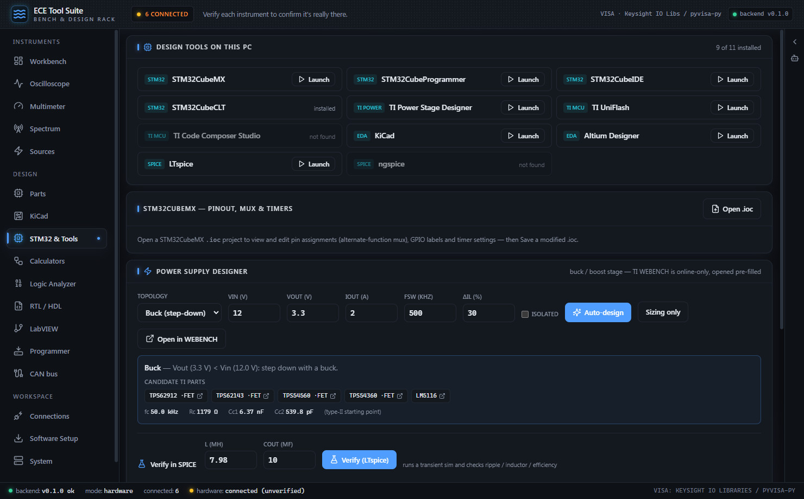

Enter Vin, Vout, Iout, switching frequency and ripple target. **Auto-design** picks the
topology and explains why, sizes the inductor and output capacitor, suggests candidate parts,
and produces a type-II compensation starting point.

Then verify it. **Verify (LTspice)** generates a self-contained switching netlist, runs it
headless, parses the `.raw`, and checks measured output regulation, ripple, inductor current
and efficiency against targets. **Verify loop** builds the open-loop model and pass/fails the
achieved phase and gain margins. There is also magnetics design against a real core and wire
database, and capacitor bank sizing.

The module states its own limits: the plant is not the full Ridley sampled-data model, and the
current-sense transresistance and reference default to generic values which come back in the
response so you can refine them from the datasheet. Treat the margins as a design review, then
confirm on the bench.

### Calculators

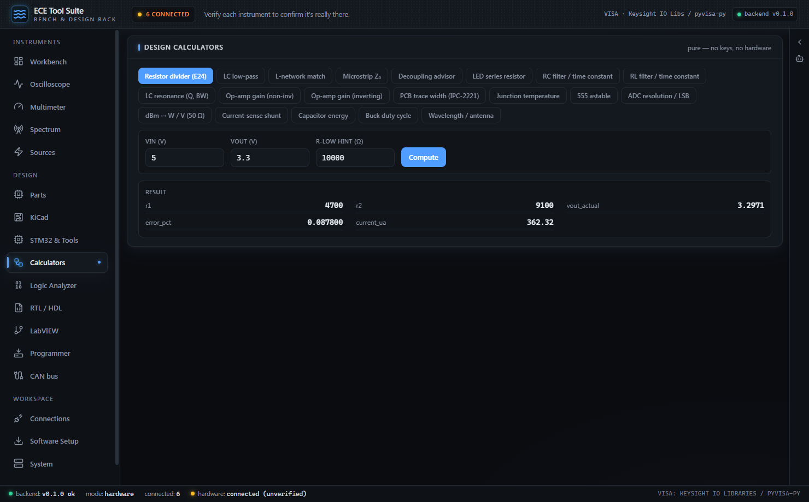

Twenty calculators in the UI and two more on the API. Resistor divider with E24 snapping, LC
low-pass, L-network match, microstrip impedance, decoupling advisor, LED series resistor, RC
and RL time constants, LC resonance, op-amp gain both ways, IPC-2221 trace width, junction
temperature, 555 astable, ADC resolution, dBm conversion, current-sense shunt, capacitor
energy, buck duty cycle and antenna wavelength.

### Parts

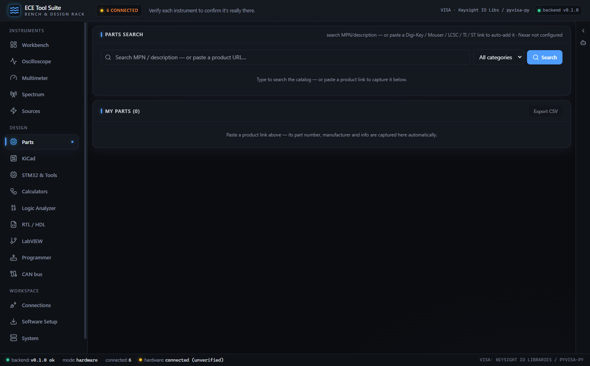

Search an offline catalog, or paste a Digi-Key, Mouser, LCSC, TI or ST product link and have
the part number, manufacturer and specs pulled out automatically. Parametric values are
normalized into spec chips so a 3.3 V part and a 3V3 part compare properly. Add
`NEXAR_CLIENT_ID` and `NEXAR_CLIENT_SECRET` for live distributor results, or connect a Digi-Key
developer app on the Connections tab.

### KiCad

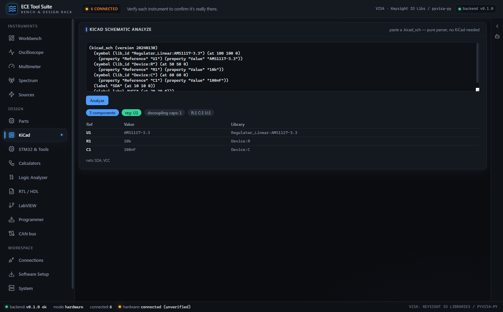

Paste a `.kicad_sch` and get components, nets and detected circuit patterns. It is a pure
parser, so KiCad does not need to be installed.

---

## Digital and embedded

### RTL and FPGA


Write Verilog, SystemVerilog or VHDL and every button hands off to a real tool: Verilator and
Verible for lint, Icarus and GHDL for simulation, Yosys for synthesis, nextpnr for
place-and-route and timing. Nothing here judges your HDL itself; the toolchain's own
diagnostics are the verdict.

Export a Xilinx, Intel or Lattice project when you want to finish in vendor tools. The
engineering-patterns library carries reference implementations of clock-domain crossing, reset
synchronization, self-checking testbenches, XDC timing and ILA debug.

Model-assisted RTL generation is available with an API key, and it only reports a result as
validated when lint and simulation actually pass. With no testbench that means lint-clean and
nothing more, which the panel says out loud.

### Logic analyzer

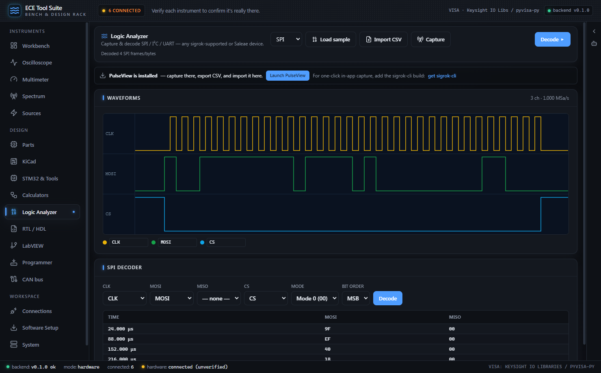

Decode SPI, I²C and UART from any source: a sigrok-supported analyzer, a Saleae, an MSO scope's
digital pod, or an imported CSV. The decoders are pure functions over sample arrays, including
UART parity and framing-error detection, and matching signal generators produce known waveforms
so the decoders are testable without hardware.

### CAN bus

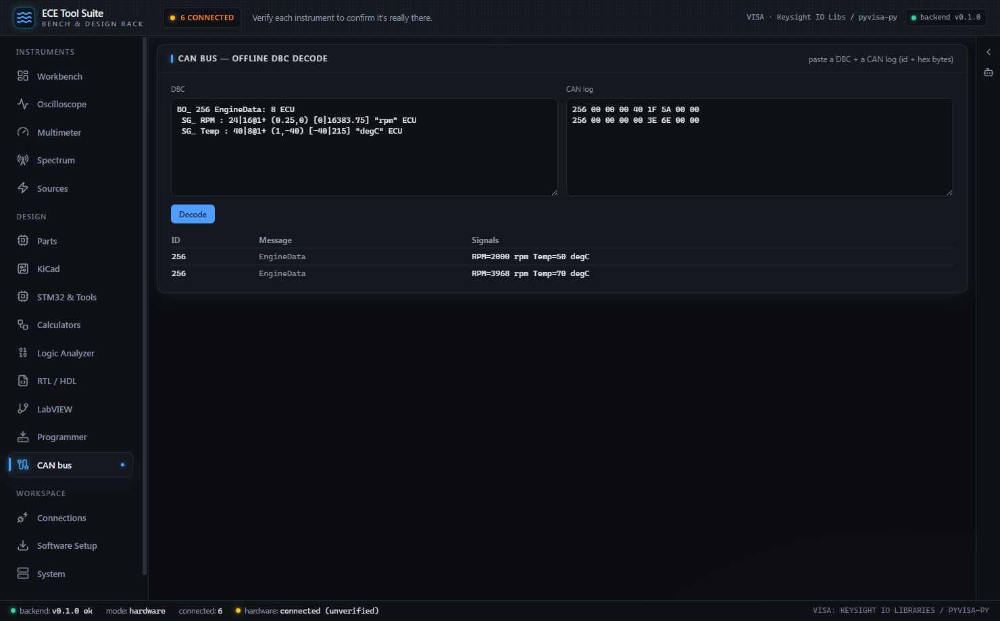

Load a DBC and decode logged frames into engineering values, with both Intel and Motorola bit
layouts.

### MCU programmer


Read a target's device ID, supply voltage and flash through a UPDI, PDI or debugWIRE debugger
(Curiosity Nano, Atmel-ICE, MPLAB SNAP, PICkit), and get the firmware back as Intel HEX. The
device catalog works offline from metadata alone. Chip erase sits behind a Danger Zone with an
explicit acknowledgement, and with no debugger attached the hardware operations error honestly
rather than pretending.

---

## Automation and integrations

### LabVIEW


Detects LabVIEW and the LabVIEW CLI, lists the `.lvproj` files it finds, and drives NI's
supported automation channel for headless VI runs, mass compile and build specs. VI Server over
COM lets you set front-panel controls, run a VI and read its indicators from the app.

### Software setup


Freely redistributable tools install from their official source with live progress. Login-gated
vendors open their official download page instead; no vendor authentication is ever bypassed. A
tool counts as installed only when detection finds the binary again afterwards.

### Agents and MCP


Two separate paths, deliberately.

The **in-app assistant** is a chatbox wired to the shared tool registry. It sees
provenance-tagged results and cannot confirm an energize on your behalf. Set
`ANTHROPIC_API_KEY` to enable it.

The **MCP server** lets an external client (Claude Desktop, Claude Code, Cursor) drive whatever
the app has connected. It opens no instruments itself; it calls the running app, so the app
keeps sole ownership of the hardware. The Connections tab generates the client config with your
interpreter path filled in. See [docs/mcp.md](docs/mcp.md).

The agent-facing surface is a strict subset of the chatbox surface, and `test_contract.py`
asserts it. No tool that can energize a DUT is reachable from the agent bridge at all.

---

## Configuration

Everything is optional. Nothing is read from a file; these are environment variables, and
[.env.example](.env.example) lists them all with notes.

| Variable | Effect |
|---|---|
| `ANTHROPIC_API_KEY` | Enables the assistant and the model-assisted RTL endpoints |
| `ECE_SUITE_MODEL` | Overrides the default model |
| `NEXAR_CLIENT_ID`, `NEXAR_CLIENT_SECRET` | Live Nexar parts search |
| `DIGIKEY_CLIENT_ID`, `DIGIKEY_CLIENT_SECRET` | Digi-Key API, also enterable in the UI |
| `ECE_SUITE_DATA` | Where the audit log and recordings go (default `~/.ece-suite`) |
| `ECE_SUITE_PORT` | Backend port (default 8848, falls back to the next free one) |
| `ECE_SUITE_HDL_BIN` | Extra directory to search for the HDL toolchain |
| `ECE_SUITE_LABVIEW_DIR` | Where VIBuilder.vi and its guide live |
| `ECE_SUITE_<ROLE>_RESOURCE` | Auto-connect a role at startup; roles are `SCOPE`, `DMM`, `SA`, `PSU`, `AWG`, `ELOAD` |

Auto-connecting looks like this:

```
ECE_SUITE_SCOPE_RESOURCE=TCPIP0::192.168.0.50::inst0::INSTR
ECE_SUITE_DMM_RESOURCE=USB0::0x2A8D::0x1234::MY51234567::INSTR
```

A failed auto-connect is written to the audit log and leaves that role disconnected. It does
not stop the app from starting.

---

## Troubleshooting

**Discover finds nothing over USB.** Install Keysight IO Libraries Suite or NI-VISA. That layer
is what enumerates USBTMC devices. LAN instruments do not need it.

**Verify fails but Connect succeeded.** The error queue came back populated, which means the
instrument rejected a command. Open the Interactive IO console on the Connections tab and send
`:SYST:ERR?` to see which one.

**The window is blank or shows an old UI.** The Electron shell loads the built renderer from
`apps/renderer/dist`. Run `npm run build`.

**`No backend interpreter found`.** The setup script has not run, or it failed partway. Re-run
it; it stops on the first failure rather than continuing.

**A tab says a tool is missing.** That is the tab telling you the truth. Install it from the
Software Setup tab, or point `ECE_SUITE_HDL_BIN` at a non-standard location.

**Something energized that should not have.** Set the limit on the instrument's front panel as
well. The software interlock stops this application from exceeding your declared envelope; it
is not a substitute for the instrument's own OVP and OCP, and the MCP server's raw SCPI
passthrough bypasses it by design.

---

## Platform support

Windows 10 and 11 is what this is developed and tested on, and the only platform CI covers.

The backend and the UI run on macOS and Linux, and LAN instruments work there through
`pyvisa-py`. Several features are Windows-only by nature and report themselves unavailable
rather than failing: LabVIEW automation goes through COM, the one-click installers use winget,
and the tool detection paths are Windows install locations. Building an installer is
Windows-only.

---

## More documentation

| Document | Covers |
|---|---|
| [User guide](docs/user-guide.md) | Connecting instruments and what each tab does |
| [Instrument support](docs/instruments.md) | Vendors, SCPI dialects, capability profiles, adding a model |
| [Developer tutorial](docs/tutorial/01-getting-started.md) | Seven chapters on how the code works |
| [MCP setup](docs/mcp.md) | Driving the bench from an external agent client |
| [Packaging](docs/packaging.md) | Building the Windows distributable |
| [Changelog](CHANGELOG.md) | What changed per release |

---

## Contributing

Issues and pull requests are welcome. [CONTRIBUTING.md](CONTRIBUTING.md) has the layout, the
three invariants that will not be relaxed, and how to add an instrument.

If you own a bench instrument this suite claims to support, confirming or correcting its
profile is the single most useful contribution. Vendor coverage beyond Keysight is written from
programming manuals, not from hardware.

One known rough edge, so you find out here rather than later:
`backend/ece_suite/main.py` holds the entire HTTP and WebSocket surface in one 2300-line
module. Splitting it into routers has to happen in one go, because the tests import from it
directly.

---

## License

MIT, see [LICENSE](LICENSE). Third-party components and their licenses are listed in
[THIRD-PARTY-NOTICES.md](THIRD-PARTY-NOTICES.md). Note that the optional `spice` extra pulls in
a GPL-3.0 library, which matters if you redistribute a build.

---

## Trademarks

This project is not affiliated with, endorsed by, or sponsored by any of the companies whose
products it talks to. Keysight, Agilent, Tektronix, Teledyne LeCroy, Keithley, RIGOL, SIGLENT,
Rohde & Schwarz, Fluke, B&K Precision, GW Instek, Yokogawa, OWON, Aim-TTi, Chroma, Kikusui,
ITECH, Pico Technology, Hantek, National Instruments, LabVIEW, Texas Instruments, WEBENCH,
STMicroelectronics, Microchip, AMD, Xilinx, Intel, Lattice, KiCad, Digi-Key, Mouser and Nexar
are trademarks of their respective owners, used here only to say which hardware and file
formats are supported.
