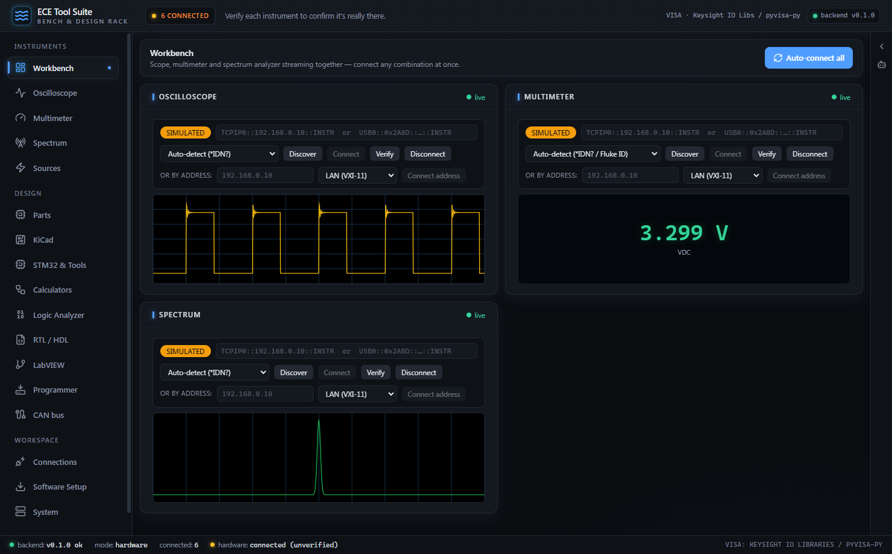
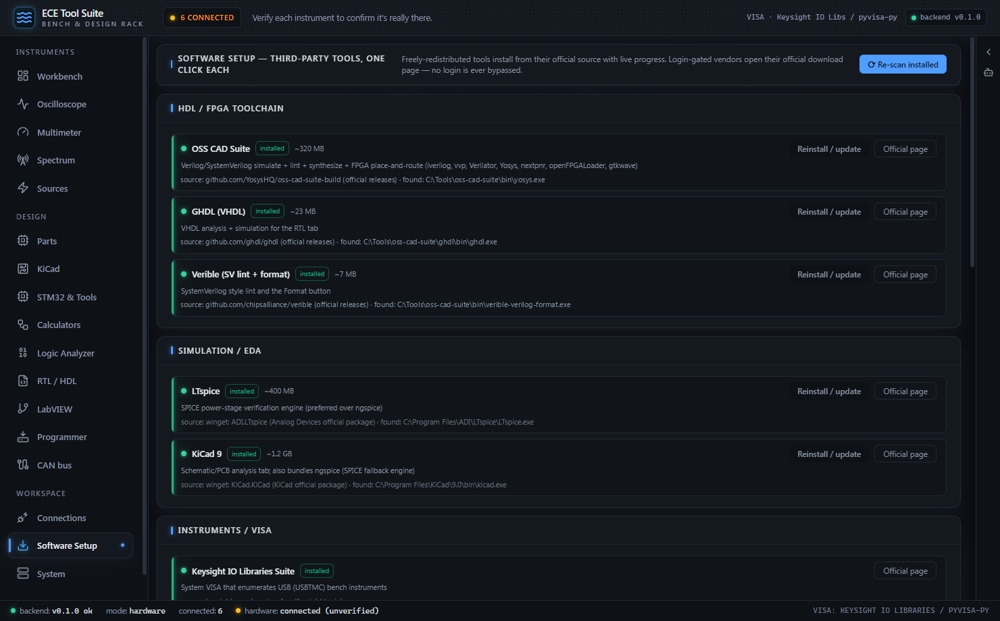

# ECE Tool Suite: developer tutorial

The ECE Tool Suite is a Windows desktop application for electrical engineers that puts a full
bench + design workflow in one window: real SCPI instruments (oscilloscope, DMM, spectrum
analyzer, PSU, function generator, e-load), power-electronics design with SPICE verification,
RTL/HDL design for FPGAs and CPLDs graded by a real open-source toolchain, LabVIEW automation,
parts search, KiCad analysis, MCU flashing, protocol decoding, and an embedded Claude assistant,
all with a strict *honest-measurement* discipline enforced in code.



*The Workbench tab with all three instruments bound: a switching-node trace on the scope, a
live VDC readout on the meter, and a tone on the spectrum analyzer, each card carrying its own
connection bar so any combination can be brought up at once.*

## The one rule everything follows

> **Nothing is ever presented as real unless the toolchain, the instrument, or the simulator
> actually said so.**

Every reading carries a provenance tag (`SIMULATED` / `UNVERIFIED_HW` / `VERIFIED_HW`) that is
structurally impossible to strip. AI-generated RTL is only "validated" when the lint + simulation
actually pass. A power design is only "verified" when LTspice measured it. An install is only
"installed" when detection re-finds the binary. This discipline shows up in every chapter below.

## Stack at a glance

| Layer | Tech | Lives in |
|---|---|---|
| Desktop shell | Electron 33 | `apps/desktop` (`main.js`, `sidecar.js`, `preload.js`) |
| UI | React 18 + Vite + Tailwind | `apps/renderer/src` (one component per tab) |
| Backend "sidecar" | Python 3.12 + FastAPI + uvicorn | `backend/ece_suite` (one module per feature) |
| Instrument I/O | PyVISA (system VISA → pyvisa-py fallback) | `backend/ece_suite/instruments` |
| Tests | pytest, **328 passed, 1 skipped** | `backend/tests` |
| Distributable | electron-builder → NSIS installer + portable exe | build output lands in `release/` (gitignored) |

The Electron process spawns the Python backend on `127.0.0.1:8848` (with automatic free-port
fallback), waits for `/health`, and loads the built React UI. The UI talks to the backend over
REST + WebSockets. Chapter 2 walks the whole spine.

## Quick start (development)

You need Python 3.12+ and Node 18+ on `PATH`. One-time setup:

```powershell
# Windows
powershell -ExecutionPolicy Bypass -File scripts\setup.ps1
```

```bash
# macOS / Linux
./scripts/setup.sh
```

Either script creates `backend/.venv`, installs the backend editable with the
`hw,assistant,mcu,labview,power,spice,rtl,dev` extras, and runs `npm install` at the repo root.
Pass `-Minimal` (PowerShell) or `--minimal` (bash) to install `dev` only; the app still runs and
the tabs that need the optional extras report what is missing instead of failing.

Then use the npm scripts:

```bash
npm test        # backend test suite; 328 passed, 1 skipped expected
npm run dev     # backend + Vite UI dev server at http://localhost:5173
npm run app     # the full native window (spawns the backend itself)
```

Each of those is a thin wrapper: `npm test` runs `pytest -q` inside `backend/.venv`, `npm run dev`
starts the backend and the Vite server together, and `npm run app` launches Electron from
`apps/desktop`.

## Quick start (just install it)

There is no prebuilt binary in the repository. `npm run dist` drives electron-builder to produce
the NSIS installer and the portable exe in `release/`; both bundle a self-contained Python
runtime, so **nothing needs to be installed first** on the target machine. See
[docs/packaging.md](../packaging.md) for the build, signing and bundling details.

Third-party tools (HDL toolchain, LTspice, KiCad, VISA, …) are one click each from the
**Software Setup** tab once the app is running (Chapter 6).



*The Software Setup tab with its catalog populated: the HDL / FPGA section (OSS CAD Suite, GHDL,
Verible) and the Simulation / EDA section (LTspice, KiCad 9), each row showing the detected
install path that earned it the `installed` badge.*

## Chapters

1. **Getting started** (this page)
2. [Architecture & core concepts](02-architecture.md): process model, provenance, registry
   surfaces, safety engine, audit log
3. [Bench instruments](03-instruments.md): scope/DMM/spectrum/sources, VISA connection flow,
   the VERIFY gate, safety-gated sourcing, streaming, logging
4. [Power design suite](04-power-design.md): auto-designer, SPICE verification, loop margins,
   magnetics, capacitor banks, calculators, parts
5. [RTL / HDL & FPGA](05-rtl-fpga.md): write/lint/simulate/synthesize Verilog, SystemVerilog
   and VHDL; FPGA mapping + timing; register maps; AI RTL; Xilinx/Intel/Lattice + CPLD projects
6. [LabVIEW, software setup, assistant & MCP](06-labview-setup-mcp.md): LabVIEW CLI automation,
   one-click third-party installs, Claude layers
7. [Development, testing & packaging](07-build-test-package.md): adding features, the test
   suite, building the Windows distributable

## Screenshot index

Every screenshot is a real capture of the running app, not a mockup. The third-party toolchain
on the capture machine was only partly installed, which is why `img/stm32.png` reports "9 of 11
installed" and a few tool chips elsewhere show as missing.

| Tab | Image |
|---|---|
| Workbench | `img/workbench.png` |
| Oscilloscope | `img/scope.png` |
| Multimeter | `img/dmm.png` |
| Spectrum | `img/sa.png` |
| Sources (PSU/AWG/E-load) | `img/source.png` |
| Parts | `img/parts.png` |
| KiCad | `img/kicad.png` |
| STM32 & Tools | `img/stm32.png` |
| Calculators | `img/circuit.png` |
| Logic Analyzer | `img/logic.png` |
| RTL / HDL | `img/rtl.png` |
| LabVIEW | `img/labview.png` |
| Programmer | `img/programmer.png` |
| CAN bus | `img/can.png` |
| Connections | `img/connections.png` |
| Software Setup | `img/setup.png` |
| System | `img/system.png` |
