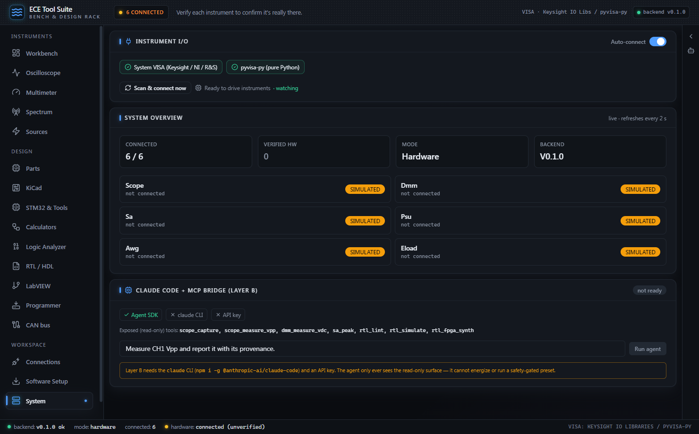

# Architecture & Core Concepts

[← Getting started](01-getting-started.md) · [Index](01-getting-started.md) · [Bench Instruments →](03-instruments.md)

The suite is three programs pretending to be one: an Electron shell that owns process lifecycle, a React renderer that draws the bench, and a Python FastAPI sidecar that talks to instruments. Provenance, safety and audit all live in the Python layer, because that is the only layer that touches hardware.

### Repository layout

```
ece-tool-suite/
├── apps/
│   ├── desktop/        # Electron main process: main.js, sidecar.js, preload.js
│   └── renderer/       # React + Vite + Tailwind UI (built to renderer/dist)
├── backend/
│   ├── ece_suite/      # the FastAPI sidecar package (python -m ece_suite.main)
│   │   ├── main.py     # app factory, /health, routers
│   │   ├── provenance.py, registry.py, safety.py, presets.py, audit.py
│   │   ├── shell_open.py # hand a path to the OS file manager / launch a tool
│   │   └── instruments/  # transports (VISA), SCPI helpers
│   ├── runtime/        # relocatable CPython, built (not committed) for packaged builds
│   └── tests/          # backend test suite
├── scripts/            # setup.ps1, setup.sh, dev.js, python.js, check-runtime.js
├── assets/
├── docs/
└── release/            # electron-builder output
```

| Piece | Tech | Role |
|---|---|---|
| `apps/desktop` | Electron (CommonJS) | Spawns/kills the backend, health-gates window load, single-instance lock |
| `apps/renderer` | React + Vite + Tailwind | All UI tabs (scope, dmm, sa, source, parts, kicad, …); talks to the backend over HTTP/WS on localhost |
| `backend/ece_suite` | Python + FastAPI | Instrument I/O, safety engine, tool registry, MCP bridge, audit log |

The renderer never talks to hardware. Every reading crosses the HTTP/WS boundary from the sidecar, which means every reading passes through the provenance serializer described below. That is deliberate: there is exactly one choke point where a value could be presented to a human, and that choke point refuses untagged data.

### Process model: Electron owns a Python sidecar

On launch, `main.js` picks a port, spawns `python -m ece_suite.main`, and refuses to load the UI until the backend proves it is alive **and ours**.

```js
// apps/desktop/main.js
const PREFERRED_PORT = Number(process.env.ECE_SUITE_PORT || 8848);
const NONCE = crypto.randomUUID(); // per-launch identity so we never adopt a foreign server

async function createWindow() {
  port = await findFreePort(PREFERRED_PORT);
  if (port !== PREFERRED_PORT) console.warn(`port ${PREFERRED_PORT} busy; backend on ${port}`);
  const s = spawnSidecar({ port, nonce: NONCE });
  sidecar = s.proc;
  // ...
  try {
    await waitForHealth(s.baseUrl, { timeoutMs: 30000, nonce: NONCE });
  } catch (e) {
    const tail = s.outputTail() || "(no output captured)";
    win.loadURL(errorPage("Backend failed to start", /* ...python path + log tail... */));
    return;
  }
  loadRenderer();
}
```

The shell generates a fresh UUID per launch and passes it to the sidecar as `ECE_SUITE_NONCE`. The window will not load the real UI until `/health` answers. If the backend dies instead, the user gets an error page containing the sidecar's actual stdout/stderr tail, not a normal-looking UI whose every call silently fails. A dead backend is reported, never papered over.

The nonce closes a specific failure mode: a stale orphan backend from a crashed run (or an unrelated app squatting on port 8848) will happily answer `/health`. Without an identity check, the shell would adopt it and you would be driving a server you did not launch, possibly a different version, possibly holding different instrument sessions.

```js
// apps/desktop/sidecar.js
async function waitForHealth(baseUrl, { timeoutMs = 20000, intervalMs = 250, nonce = "" } = {}) {
  const deadline = Date.now() + timeoutMs;
  let lastErr;
  while (Date.now() < deadline) {
    try {
      const r = await fetch(`${baseUrl}/health`);
      if (r.ok) {
        const h = await r.json();
        // Identity check: only adopt the server WE launched. A stale orphan from a crashed
        // run (or an unrelated app on this port) answers /health without our nonce.
        if (!nonce || h.nonce === nonce) return h;
        lastErr = new Error("a different server answered /health (nonce mismatch)");
      }
    } catch (e) { lastErr = e; }
    await new Promise((res) => setTimeout(res, intervalMs));
  }
  throw new Error(`sidecar /health not ready in ${timeoutMs}ms: ${lastErr}`);
}
```

The poll hits `/health` every 250 ms and only accepts a response that echoes back this launch's nonce. The backend side is trivial: `health()` in `backend/ece_suite/main.py` returns `"nonce": os.environ.get("ECE_SUITE_NONCE", "")` along with version, instrument status, and whether any hardware connection is verified.

Three more lifecycle decisions worth knowing:

- **Single-instance lock.** `app.requestSingleInstanceLock()` in `main.js`. A second launch focuses the existing window instead of spawning a second backend that would fight over the port and the data directory.
- **Free-port fallback.** `findFreePort()` probes 8848 first (docs and the MCP config assume it); if it is taken, it binds port 0 and takes whatever the OS hands back. The renderer learns the real port over IPC (`ipcMain.handle("backend-port", ...)`), so nothing hardcodes 8848 past this point.
- **Pipe draining.** `spawnSidecar()` attaches listeners to the child's stdout *and* stderr unconditionally, keeping only a 60-line tail. This is not cosmetic: uvicorn logs synchronously, and an undrained 64 KB OS pipe buffer would eventually block the backend mid-session, a server freeze that looks like a hardware hang.

`sidecar.js` also handles interpreter resolution: dev checkouts use `backend/.venv`, packaged builds use a relocatable python-build-standalone runtime under `resources/backend/runtime` (a venv cannot be shipped; its `pyvenv.cfg` points at the build machine's base interpreter). The same module is shared with the packaging smoke test so dev launch and packaged launch exercise the identical code path.


*Once the health gate passes, the window loads and the status bar along the bottom reports the sidecar state: `backend: ok`, `mode: hardware`, and the connected count. The System tab puts the same numbers in cards, with a per-role provenance badge next to each instrument.*

### Provenance: no reading exists untagged

`backend/ece_suite/provenance.py` is the load-bearing honesty primitive. Every measurement value carries one of three tags:

| Tag | Meaning | How you get it |
|---|---|---|
| `SIMULATED` | Produced by a simulator; no hardware involved | SimTransport output |
| `UNVERIFIED_HW` | Came off real hardware, but the connection has not passed the identity+readback gate | Default for any `VisaTransport` |
| `VERIFIED_HW` | Confirmed against a live, identified instrument (`*IDN?` acked + verify-read passed) | Only via the verification gate promoting the transport |

The enforcement is *structural*, not conventional. `Reading` and `Waveform` are frozen dataclasses whose `provenance` field is required and type-checked in `__post_init__`; constructing one without a valid `Provenance` enum member is a `TypeError`. The wire serializer applies the same rule:

```python
# backend/ece_suite/provenance.py
def _require_provenance(p: Any) -> Provenance:
    if not isinstance(p, Provenance):
        raise TypeError(
            "provenance must be a Provenance enum member, got "
            f"{type(p).__name__!r}; refusing to create an untagged value"
        )
    return p

def to_wire(obj: Any) -> dict:
    """Serialize a Reading/Waveform for the API/WS boundary, guaranteeing the provenance
    tag is present. Anything provenance-bearing is accepted; anything else is rejected."""
    prov = getattr(obj, "provenance", None)
    _require_provenance(prov)
    ...
```

There is no code path from "value exists in Python" to "value appears in the UI or a tool result" that skips the tag. You cannot forget it, and a bug that drops it fails loudly at the boundary instead of quietly presenting a simulated number as a bench measurement.

Trust is a one-way ratchet. The enum defines a rank (`SIMULATED=0 < UNVERIFIED_HW=1 < VERIFIED_HW=2`) and `Reading.downgraded_to()` will copy a reading at *lower* trust but raises `ValueError` if you try to go up:

```python
# backend/ece_suite/provenance.py
def downgraded_to(self, p: Provenance) -> "Reading":
    """Return a copy with trust lowered. Raising trust this way is forbidden."""
    p = _require_provenance(p)
    if p.rank > self.provenance.rank:
        raise ValueError(
            f"cannot raise provenance {self.provenance.value} -> {p.value} "
            "without passing the corresponding verification gate"
        )
    return Reading(self.value, self.unit, p, self.source, self.timestamp, dict(self.meta))
```

Promotion happens in exactly one place: the transport. `VisaTransport` (in `backend/ece_suite/instruments/transport.py`) starts every connection at `UNVERIFIED_HW` and exposes `promote_to_verified()`, which the verification gate calls only after a successful `*IDN?` plus read-back. The class-level ceiling means the sim transport can never be promoted at all. Any code that tried to launder a simulated value into a "real" one would have to fight the type system, not just a naming convention.

The same discipline is extended to the AI layer via `tag_tool_result()`, which stamps `_provenance` and a plain-English `_provenance_note` ("This value came from the simulator. It is NOT a real measurement.") onto every tool payload. The model cannot receive a value without being told whether it is real.

### Tool registry and surfaces

`backend/ece_suite/registry.py` is the single source of truth for what the app can do, projected onto three *surfaces*:

| Surface | Consumer | What it may do |
|---|---|---|
| `CHATBOX` | In-app Claude assistant | Read + configure; sees `confirm_required` tools but cannot self-confirm them |
| `AUTONOMOUS` | Claude Code / MCP bridge | Strictly narrower: never sees `SOURCE_CONTROL` tools, never sees `confirm_required` tools |
| `UI` | Renderer buttons/panels | Everything |

A contract test asserts `AUTONOMOUS ⊆ CHATBOX`, so an unattended agent can never quietly gain a capability the supervised assistant does not have. The filter is a few lines:

```python
# backend/ece_suite/registry.py
# Capabilities the autonomous bridge is NEVER allowed to invoke.
_AUTONOMOUS_FORBIDDEN = {Capability.SOURCE_CONTROL}

@dataclass
class ToolSpec:
    name: str
    description: str
    fn: Callable[..., dict]
    capability: Capability
    confirm_required: bool = False
    provenance_bearing: bool = True

    def visible_to(self, surface: Surface) -> bool:
        if surface is Surface.AUTONOMOUS:
            if self.capability in _AUTONOMOUS_FORBIDDEN:
                return False
            if self.confirm_required:
                return False
        return True
```

`SOURCE_CONTROL` is the capability that energizes a device under test, the one class of tool where a wrong call costs a board. The autonomous surface simply cannot see those tools; there is no "please confirm" flow to socially engineer, because the tool is not in the list.

The dispatch path enforces the human gate:

```python
# backend/ece_suite/registry.py, inside ToolRegistry.call()
if spec.confirm_required and not human_confirmed:
    # The assistant can SEE a confirm-required tool (so it can guide the user) but
    # may never self-confirm it. Only a human action sets human_confirmed=True.
    raise PermissionError(
        f"tool {name!r} requires explicit human confirmation; the assistant "
        "cannot self-confirm an energize/source operation"
    )
result = spec.fn(**args)
if spec.provenance_bearing:
    prov = result.get("provenance")
    if prov is None:
        raise RuntimeError(
            f"tool {name!r} is provenance-bearing but returned no provenance tag"
        )
    return tag_tool_result(result, Provenance(prov))
```

`human_confirmed=True` is only ever set by an actual UI click, never by model output. The last four lines close the loop with the provenance system: a tool marked `provenance_bearing` that returns an untagged result is a hard `RuntimeError`, not a warning.

### Safety engine: default-deny for anything that energizes

`backend/ece_suite/safety.py` evaluates each proposed instrument action into `ALLOW`, `REQUIRE_CONFIRM`, or `BLOCK`, with cited reasons and a most-restrictive-wins combination rule. It is explicitly a *secondary* guard; the real protection is the instrument's own hardware OVP/OCP and front-end absolute-maximum ratings. The engine's job is to refuse to let software pretend to be that mechanism.

The core stance is default-deny: a source operation with no declared DUT envelope is blocked, full stop.

```python
# backend/ece_suite/safety.py
@dataclass(frozen=True)
class DUTSafetyEnvelope:
    """The declared safe operating area of the device under test. Required before any
    source/load operation — there is no safe default, so its absence is default-deny."""
    max_voltage: float
    max_current: float
    min_current: float = 0.0
    polarity: str = "positive"   # positive | negative | bipolar

# inside SafetyInvariantEngine.evaluate():
if is_source and action.op in (OpType.SET_LEVEL, OpType.ENABLE_OUTPUT):
    if envelope is None:
        findings.append((Verdict.BLOCK,
            "SOURCE_CONTROL is default-denied until a DUT SafetyEnvelope is declared"))
```

There is no plausible default "safe voltage" for an unknown board, so the engine refuses to invent one. You declare what your DUT tolerates before the suite will set a level or enable an output. Set-level requests are then checked against *both* the envelope and a `RatingModel` (the instrument's datasheet limits): a value can be inside one and outside the other, and either violation blocks.

Other invariants in the same pass:

- **Native `:AUToscale` is forbidden** in any automated path (`BLOCK`). Autoscale hands range selection to the instrument with no bound on what it will do to the front end; presets must use app-computed, bounded `:RANGe`/`:SCALe`/`:OFFSet` followed by a verify-read.
- **Enabling an output always requires human confirmation** (`REQUIRE_CONFIRM`), even inside a fully-valid envelope. Energizing a DUT is never automatic.
- **Scope front-end abs-max is computed live** from impedance, coupling, and probe attenuation (`effective_abs_max_v`): 5 V at 50 Ω, 300 V at 1 MΩ, scaled by attenuation. An expected input above that ceiling blocks the configure, because 50 Ω front ends die quietly.

### PresetRunner: transactional configuration with rollback

`backend/ece_suite/presets.py` executes ordered SCPI step lists under the safety engine, with the transaction semantics of "either the whole preset lands verified, or the output is off."

Before executing anything, ordering is validated: at most one `ENABLE_OUTPUT` step, it must be *last*, and protective limits (`SET_PROTECTION`, meaning OVP/OCP) must appear before it. Then each step runs the full gauntlet: safety verdict, SCPI write, `:SYST:ERR?` queue drain (must come back empty), and a verify-read against an expected value. Any failure aborts:

```python
# backend/ece_suite/presets.py
def _abort(self, results: list[StepResult], prov: str, *, reason: str) -> PresetResult:
    # rollback: unconditional output-off FIRST, no matter what
    try:
        self.t.write(self.output_off_scpi)
        drain_error_queue(self.t)
    except Exception:  # noqa: BLE001 - rollback must never raise
        pass
    self._audit("preset_rollback", instrument=self.instrument, reason=reason)
    return PresetResult(False, prov, results, True, f"ABORTED + rolled back: {reason}")
```

The first rollback action is always output-off, unconditionally, before anything else. Rollback itself is not allowed to raise, because a rollback that throws leaves the DUT energized in an unknown state, which is the exact outcome the runner exists to prevent.

The runner also has a `preview()` method: same ordering check and per-step safety evaluation, zero execution. The UI calls it to paint ALLOW / REQUIRE_CONFIRM / BLOCK badges on a preset card *before* the user hits run, so a doomed preset is visibly doomed up front.

> **Hardware note:** the safety engine and preset runner are pure logic and run identically against any `Transport`. Actually executing a preset end-to-end requires a connected instrument (Keysight bench gear over VISA: LAN works out of the box via pyvisa-py; USB/serial/GPIB need the optional `[hw]` extras). Results carry the transport's provenance, so a preset run without a verified connection is honestly labeled `UNVERIFIED_HW`.

### Audit log: append-only, greppable

`backend/ece_suite/audit.py` is deliberately small, about 30 lines:

```python
# backend/ece_suite/audit.py
class AuditLog:
    def record(self, event: str, **fields: Any) -> dict:
        """Append one event. Returns the written record (incl. seq + ts)."""
        with self._lock:
            self._seq += 1
            rec = {"seq": self._seq, "ts": time.time(), "event": event, **fields}
            with self.path.open("a", encoding="utf-8") as fh:
                fh.write(json.dumps(rec, default=str) + "\n")
            return rec
```

Every safety-relevant action (instrument writes, preset runs and rollbacks, output-enables, provenance promotions) lands here as one JSON line with a monotonic sequence number under a thread lock. JSON-lines was chosen over a database on purpose: you can `tail -f` it during a bench session and grep it after one, and an append-only file has no update path that could rewrite history.

### Why this shape

Every design above serves one discipline: **the app must never claim more truth than it has.**

- The nonce and health gate exist so the UI is never wired to a backend it does not know.
- Provenance is structural (`TypeError`, not a lint rule) so a simulated value cannot be mistaken for a bench measurement even by accident.
- Trust ratchets down freely and up only through the `*IDN?`+readback gate, so "VERIFIED_HW" always means a specific, identified, answering instrument.
- The autonomous surface is subtractive, so unattended AI can analyze and read but can never energize anything.
- The safety engine defaults to denial because "no envelope declared" is not the same as "any voltage is fine."
- The preset runner treats configuration as a transaction whose failure mode is *output off*, and the audit log makes every one of those decisions reconstructable after the fact.

If you extend the suite with a new instrument, a new tool or a new tab, the contract is: return provenance-tagged results, register through `ToolRegistry` with an honest capability, and route anything that sets a level or closes a relay through the safety engine. The rest of the architecture then defends your feature the same way it defends the built-ins.

---
[← Getting started](01-getting-started.md) · [Bench Instruments →](03-instruments.md)
