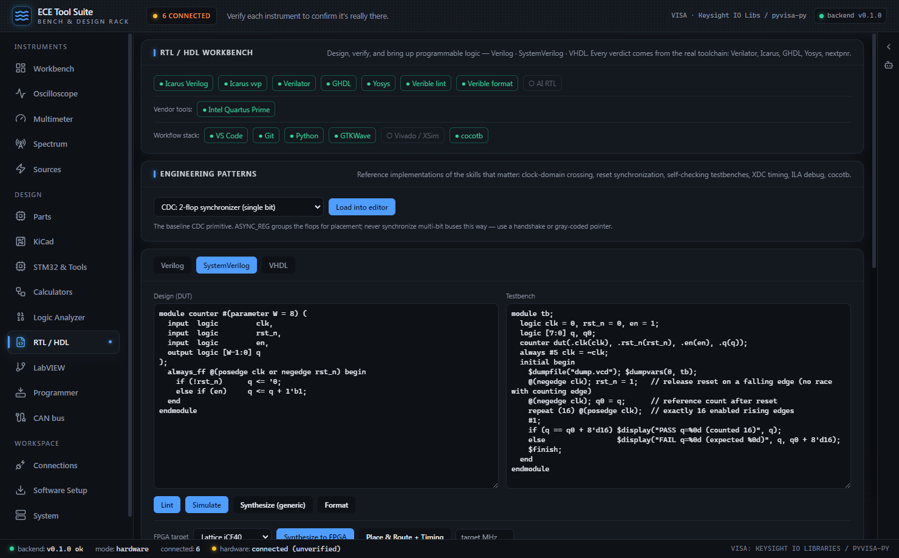

# RTL / HDL & FPGA

[← Power Design Suite](04-power-design.md) · [Index](01-getting-started.md) · [LabVIEW, Software Setup, Assistant & MCP →](06-labview-setup-mcp.md)

The RTL tab (`apps/renderer/src/components/RtlTab.tsx`, backend `backend/ece_suite/rtl.py`) turns the suite into a small digital-design bench: you write Verilog / SystemVerilog / VHDL in the browser, and every button shells out to a **real** open-source EDA tool (Verilator, Icarus Verilog, GHDL, Yosys, nextpnr, Verible). Nothing on this tab ever "judges" your HDL itself; the toolchain's own diagnostics are the verdict. This is the same lab-truth philosophy the instrument tabs use for hardware measurements, applied to RTL.


*The RTL / HDL tab with the SystemVerilog counter sample loaded: toolchain status chips (Icarus Verilog, Icarus vvp, Verilator, GHDL, Yosys, Verible lint, Verible format, AI RTL), the DUT and testbench editors, and the two action rows.*

### Toolchain detection

On mount the tab calls `GET /api/rtl/status`, which runs `rtl.toolchain()`. Each tool is probed on `PATH` **and** in the standard OSS CAD Suite unpack locations, so a plain unzip of the YosysHQ bundle works with zero configuration:

```python
def _search_dirs() -> list[str]:
    dirs: list[str] = []
    env = os.environ.get("ECE_SUITE_HDL_BIN")
    if env:
        dirs.append(env)
    home = Path.home()
    for base in (
        Path(r"C:\oss-cad-suite"), Path(r"C:\tools\oss-cad-suite"),
        home / "oss-cad-suite", Path(r"C:\ProgramData\oss-cad-suite"),
        Path("/opt/oss-cad-suite"), home / "oss-cad-suite",
    ):
        dirs.append(str(base / "bin"))
        # GHDL's Windows build ships its own mingw DLLs that could collide with the suite's,
        # so it lives in an isolated ghdl/ subdir (DLLs resolve from the exe's own dir).
        dirs.append(str(base / "ghdl" / "bin"))
        dirs.append(str(base))
    return dirs
```
*`backend/ece_suite/rtl.py`: where the backend looks for HDL tools.* Set `ECE_SUITE_HDL_BIN` to point at a non-standard install; otherwise `C:\oss-cad-suite\bin` and friends are searched after `PATH`. Note the isolated `ghdl\bin` subdir: GHDL's Windows build carries its own MinGW DLLs that would collide with the suite's if they shared a folder.

Two Windows-specific gotchas are handled for you:

```python
def _tool_env() -> dict:
    """Environment for running the toolchain. OSS CAD Suite tools spawn helper exes from
    ``bin``/``lib`` (iverilog -> ivl/ivlpp, yosys -> yosys-abc) and Verilator reads its data
    via ``VERILATOR_ROOT`` — without these the tools crash or can't find their built-ins."""
    global _ENV_CACHE
    if _ENV_CACHE is not None:
        return _ENV_CACHE
    env = os.environ.copy()
    # nextpnr (and other tools) embed a Python interpreter; if it inherits the host venv's
    # PYTHONHOME/PYTHONPATH it loads the wrong stdlib and crashes ("failed to get the Python
    # codec of the filesystem encoding"). Drop them so the bundled interpreter is used.
    for var in ("PYTHONHOME", "PYTHONPATH", "PYTHONSTARTUP"):
        env.pop(var, None)
    root = _suite_root()
    if root:
        extra = os.pathsep.join(str(root / d) for d in ("bin", "lib", "py3bin") if (root / d).is_dir())
        if extra:
            env["PATH"] = extra + os.pathsep + env.get("PATH", "")
        vroot = root / "share" / "verilator"
        if vroot.is_dir():
            env.setdefault("VERILATOR_ROOT", str(vroot))
    _ENV_CACHE = env
    return env
```
*`backend/ece_suite/rtl.py`: every subprocess runs with this environment.* Two fixes live here. First, `PYTHONHOME`/`PYTHONPATH` are stripped because nextpnr embeds its own Python interpreter; inheriting the FastAPI venv's variables makes it load the wrong stdlib and die with a cryptic codec error. Second, the suite's `bin`/`lib`/`py3bin` dirs are prepended to `PATH` so tools that spawn helpers (iverilog → `ivlpp`, yosys → `yosys-abc`) can find them, and `VERILATOR_ROOT` is set so Verilator finds its data files. There's a related quirk in `_verilator()`: on Windows the plain `verilator` in OSS CAD Suite is a POSIX shell-script wrapper that won't run natively, so `verilator_bin.exe` is preferred.

The status card at the top of the tab renders one chip per tool (● installed / ○ missing), an **AI RTL** chip (lit when `ANTHROPIC_API_KEY` is configured), and a "Vendor tools" row if any of Vivado / Quartus / Radiant / Diamond is detected on disk. If nothing at all is found, the card shows an install pointer to the OSS CAD Suite release page, which bundles every tool this tab drives in one download.

### Language support: honest levels

| Language | Lint | Simulate | Generic synth | FPGA synth / P&R | Format |
|---|---|---|---|---|---|
| Verilog | Verilator `--lint-only -Wall` (fallback: `iverilog -g2005 -t null`) | Icarus (`iverilog` + `vvp`) | Yosys | Yosys `synth_<family>` + nextpnr | Verible |
| SystemVerilog | same, with `-sv` / `-g2012` | Icarus `-g2012` | Yosys `read_verilog -sv` | same | Verible |
| VHDL | GHDL `-s --std=08` | GHDL analyze/elaborate/run (VHDL-2008) | **Not supported**: needs the yosys-ghdl plugin | **Not supported**: same reason | **No VHDL formatter wired** |

VHDL gets first-class lint and simulation through GHDL, but every synthesis path (`synthesize`, `fpga_synth`, `fpga_timing`) returns an explicit error for VHDL: *"VHDL synthesis needs the yosys-ghdl plugin; use Verilog/SystemVerilog for stats."* The UI mirrors this honestly: the Synthesize, Format, FPGA, and P&R buttons are disabled while the VHDL sample is loaded. If a `language` isn't specified, `_norm_lang()` sniffs the source: `entity`/`architecture` ⇒ VHDL, `always_ff`/`always_comb`/`logic`/`typedef` ⇒ SystemVerilog, else Verilog.

### The editors panel

The top card holds three language buttons (Verilog / SystemVerilog / VHDL) that load a matched **DUT + testbench sample pair**: an 8-bit counter with a self-checking testbench for SV, a 4-bit adder for Verilog, an inverter with VHDL asserts for VHDL. Below the two editors sit two button rows:

- **Lint · Simulate · Synthesize (generic) · Format**: the language-agnostic flow.
- **FPGA target selector · Synthesize to FPGA · Place & Route + Timing · target MHz input**: the device flow.

Every action posts the current editor contents; results accumulate in a single **Results** card at the bottom of the tab so you can compare lint, sim, and synth output side by side.

### Lint

`POST /api/rtl/lint` prefers Verilator (`--lint-only -Wall -Wno-DECLFILENAME`; the suppression exists because the temp-file harness means the module name never matches the filename), falls back to Icarus in null-target mode, and uses `ghdl -s --std=08` for VHDL. All tool stderr is normalized through one parser:

```python
def parse_diagnostics(text: str, kind: str = "generic") -> list[dict]:
    """Parse a compiler/linter stderr blob into structured diagnostics.

    ``kind`` selects the primary matcher ("verilator" | "iverilog" | "ghdl" | "verible" |
    "generic"); the generic ``path:line[:col]: msg`` matcher is always tried as a fallback so
    one function covers every tool we shell out to.
    """
    out: list[dict] = []
    for raw in text.splitlines():
        line = raw.rstrip()
        if not line.strip():
            continue
        m = _VERILATOR_RE.match(line) if kind == "verilator" else None
        if m:
            out.append({
                "severity": _sev_norm(m.group("sev")),
                "code": m.group("code"),
                "file": m.group("file"), "line": int(m.group("line")) if m.group("line") else None,
                ...
```
*`backend/ece_suite/rtl.py`: one diagnostic parser for five tools.* Verilator's `%Error:`/`%Warning-NAME:` format gets its own regex; everything else falls through to a generic `path:line[:col]: severity: message` matcher. The output is a uniform `{severity, code, file, line, col, message}` list, which is what the React `Diagnostics` component renders and, more importantly, what gets fed back to the AI loop verbatim. A defensive tail catches the case where a linter exits non-zero without a parseable error: the last three lines of output become a synthetic error, so a crash can never masquerade as "clean". The result carries `clean` (zero errors), plus `errors`/`warnings` counts.

### Simulate: VCD capture and the testbench-owned verdict

`POST /api/rtl/simulate` compiles DUT + testbench together (Icarus for Verilog/SV, GHDL analyze→elaborate→run with `--vcd=dump.vcd --stop-time=10ms` for VHDL) and runs it. The key design decision is **who gets to declare PASS**:

```python
def simulate(source: str, testbench: str, language: str | None = None,
             top: str | None = None, timeout: float = 60.0) -> dict:
    """Compile DUT+testbench and run it; capture stdout, a PASS/FAIL verdict, and any VCD.

    The testbench drives the verdict: if it prints pass/fail (or uses ``$fatal``/assertions),
    that text is what we report. The model never gets to *claim* a pass the simulator didn't
    produce. Have the testbench ``$dumpfile("dump.vcd"); $dumpvars;`` to get a waveform back.
    """
```
*`backend/ece_suite/rtl.py`: the simulate contract.* After the run, the combined stdout/stderr log is scanned with two regexes: `fail|failed|error|mismatch|assertion|fatal` and `pass|passed|all tests passed|ok|success`. **Fail wins over pass.** The verdict is `"fail"`, `"pass"`, or `"ran"` (the sim completed but the testbench printed neither; write self-checking testbenches if you want a green badge). A compile failure short-circuits to `verdict: "compile_error"` with structured diagnostics. This matters because the AI loop (below) treats this verdict as ground truth: the model literally cannot claim a pass the simulator didn't print.

If the testbench does `$dumpfile("dump.vcd"); $dumpvars;`, `_summarize_vcd()` returns the signal list, the end time, and (for files ≤ 256 KB) the raw VCD text. The Results card shows the signal names and `t_end`; the full VCD text is in the API response if you want to hand it to a waveform viewer.

### Synthesize (generic): Yosys cell/area stats

`POST /api/rtl/synth` runs `yosys -p "read_verilog [-sv] dut.v; synth -top <top>; stat"` (or `synth -auto-top` when no module is found; when the source has several modules, the **last** one is assumed to be the top, so pass `top` explicitly to override). `_parse_yosys_stat()` handles both the modern `stat` table (`<N> wires / <N> cells / <N> $_AND_`) and the pre-0.40 `Number of cells: N` format, isolating the **last** `=== module ===` block so hierarchical designs report the elaborated top. The result splits into `stats` (wires, cells, memories, processes, …) and `cells` (per-cell-type counts), both rendered as chips in the Results card. This is a technology-independent gate count: good for "did my rewrite actually shrink the design", not for device fitting. Use the FPGA flow for that.

### Synthesize to FPGA: real device mapping with utilization buckets

`POST /api/rtl/fpga` runs the family-specific Yosys flow (`synth_ice40`, `synth_ecp5`, `synth_machxo2`, `synth_gowin`), which maps your RTL to **actual vendor primitives**: `SB_LUT4`/`SB_CARRY` for iCE40, `TRELLIS_COMB`/`TRELLIS_FF` for ECP5, `GW_*` for Gowin. The raw cell counts are then folded into six human-readable buckets:

```python
# regex → utilization bucket, matched against the synth cell-type names of any family
_UTIL_BUCKETS = [
    ("luts", re.compile(r"(SB_LUT4|TRELLIS_COMB|\bLUT[1-6]?\b|CCU2|ALU54|GW_LUT)", re.I)),
    ("ffs", re.compile(r"(DFF|_FF\b|TRELLIS_FF|GW_DFF|FD1)", re.I)),
    ("carry", re.compile(r"(SB_CARRY|CCU2|CARRY)", re.I)),
    ("bram", re.compile(r"(RAM40|DP16KD|PDPW16KD|BRAM|GW_BRAM|EBR|RAMW)", re.I)),
    ("dsp", re.compile(r"(SB_MAC16|MULT|MAC|DSP|ALU54)", re.I)),
    ("io", re.compile(r"(SB_IO|TRELLIS_IO|GW_IOB|IOB|BB\b|OBUF|IBUF)", re.I)),
]
```
*`backend/ece_suite/rtl.py`: one bucket table covers every family's primitive names.* Each mapped cell type is matched against these patterns in order and counted into the first bucket that hits, so the Results card shows `LUTS / FFS / CARRY / BRAM / DSP / IO` chips regardless of which family you targeted. The response also reports whether the matching nextpnr binary is present (`pnr_available`), plus which common dev boards carry that family.

Open-flow families available in the target dropdown:

| Family | Yosys flow | nextpnr | Bitstream pack | Typical boards |
|---|---|---|---|---|
| Lattice iCE40 | `synth_ice40` | `nextpnr-ice40` | `icepack` | iCEstick, iCE40-HX8K, TinyFPGA, Icebreaker |
| Lattice ECP5 | `synth_ecp5` | `nextpnr-ecp5` | `ecppack` | ULX3S, ECP5 Evn, OrangeCrab, Colorlight |
| Lattice MachXO2 | `synth_machxo2` | `nextpnr-machxo2` | `ecppack` | MachXO2 breakout, TinyFPGA A |
| Gowin LittleBee | `synth_gowin` | `nextpnr-himbaechel` | `gowin_pack` | Tang Nano 9K/20K, Tang Primer |

### Place & Route + Timing: nextpnr Fmax

`POST /api/rtl/timing` is the real "compilation and timing analysis" step: Yosys writes a JSON netlist (`synth_<family> -json dut.json`), then nextpnr places and routes it on a concrete part and computes the achievable clock frequency. This flow is **wired for iCE40 and ECP5 only**: the other families synthesize fine but their nextpnr device flags are part-specific, and the backend says so explicitly rather than guessing. Default parts: iCE40 `hx8k` in a `ct256` package (with `hx1k`/`up5k`/`lp8k`/`u4k` selectable via the `device` field), ECP5 `25k` (also `12k`/`45k`/`85k`). Both run with `--pcf-allow-unconstrained` / `--lpf-allow-unconstrained` so you can time a design before you've assigned a single pin.

Enter a value in the **target MHz** box and it becomes nextpnr's `--freq` constraint; the log parser then extracts per-clock verdicts:

```python
_FMAX_RE = re.compile(r"Max frequency for clock\s+'([^']+)':\s+([\d.]+)\s*MHz"
                      r"(?:\s*\((PASS|FAIL) at ([\d.]+)\s*MHz\))?")
# nextpnr prefixes log lines with "Info:" and tabs; match "<NAME>: used/ total pct%" anywhere.
_UTIL_RE = re.compile(r"([A-Z][A-Z0-9_]+):\s+(\d+)\s*/\s*(\d+)\s+(\d+)\s*%")
...
    # nextpnr reports Fmax at several stages; keep the last (post-route) value per clock.
    by_clock: dict[str, dict] = {}
    for m in _FMAX_RE.finditer(log):
        by_clock[m.group(1)] = {"clock": m.group(1), "fmax_mhz": float(m.group(2)),
                                "verdict": m.group(3),
                                "target_mhz": float(m.group(4)) if m.group(4) else None}
```
*`backend/ece_suite/rtl.py`: Fmax extraction.* nextpnr prints Fmax after placement *and* after routing; keeping the last match per clock means you always get the post-route (pessimistic, correct) number. The response carries `clocks` (Fmax + PASS/FAIL per clock), `met_timing` (all clocks passed, or `null` when no clocks were found), a `utilization` map of `used/total (pct%)` per resource type straight from nextpnr's device report, and the last 40 log lines for forensics. The Results card badges the run **meets timing** / **FAILS timing** accordingly.

### GenAI RTL: the validation-gate philosophy

The "GenAI RTL" card (`backend/ece_suite/rtl_ai.py`) lets Claude design or optimize RTL, but the module's founding rule is that **the verdict is never the model's to give**. Every candidate the model produces is run through the same `rtl.lint()` and (when a testbench exists) `rtl.simulate()` you'd use manually, and only a tool-clean result is labeled *validated*:

```python
def _validate(code: str, language: str, testbench: str | None, top: str | None) -> dict:
    """Run the ground-truth gate: lint always, simulate when a testbench is present."""
    lint = rtl.lint(code, language, top=top)
    result = {"lint": lint}
    ok = bool(lint.get("ok")) and lint.get("errors", 1) == 0
    if testbench:
        sim = rtl.simulate(code, testbench, language, top=top)
        result["sim"] = sim
        ok = ok and sim.get("ok") and sim.get("compiled") and sim.get("verdict") in ("pass", "ran")
        # if the tb prints an explicit pass, require it
        if sim.get("verdict") == "fail":
            ok = False
    result["validated"] = bool(ok)
    return result
```
*`backend/ece_suite/rtl_ai.py`: the ground-truth gate.* The system prompt even tells the model "Never claim a design passes; the toolchain decides."

**Generate RTL** (`POST /api/rtl/generate`) takes a natural-language spec (default sample: *"A synchronous 8-bit up/down counter with load and enable."*). If the testbench editor is non-empty it is sent along, and the model is warned its ports must match. The loop runs up to `max_rounds` (default 3): model proposes → toolchain validates → on failure, `_diag_feedback()` converts the structured diagnostics (`[error] line 12:5: ...`, simulator output, "Testbench reported a FAILURE") into a corrective prompt and the model tries again. The response reports per-round validation results and an honest final flag: the UI shows either **validated by toolchain** (green) or **not validated (N rounds)** (amber). Either way the last candidate is loaded into the DUT editor so you can inspect and fix it yourself.

**Optimize** (`POST /api/rtl/optimize`) rewrites the current DUT for a chosen goal (area / timing / power / readability) with an even stricter contract: it snapshots a baseline validation + generic synth, gets one candidate from the model, re-validates, and **if the candidate fails, the original source is kept** and `accepted: false` comes back with the note *"Optimized RTL did not validate; keeping the original."* Correctness is never traded for a smaller cell count. When accepted, the Results card shows the before → after cell count from the two Yosys runs.

AI features require `ANTHROPIC_API_KEY` (model overridable via `ECE_SUITE_MODEL`); without it the buttons are disabled and the card says so. Note the gate's honest limit: with no testbench, "validated" means *lint-clean*, not *functionally correct*; supply a self-checking testbench to make the gate mean something.

### Register map → SystemVerilog + documentation

`backend/ece_suite/regmap.py` generates a synthesizable register block **and** its Markdown datasheet from one JSON spec, so RTL and docs cannot drift. The tab pre-loads a worked example; press **Generate register block** and the SystemVerilog lands in the DUT editor (language auto-switches to SystemVerilog) while the Markdown preview fills the right-hand pane.

#### Spec format: every field

Top level:

| Field | Type | Default | Meaning |
|---|---|---|---|
| `name` | string | `"regs"` | Block name; the module is emitted as `<name>_regs` |
| `data_width` | int | `32` | Bus data width; must be 8, 16, 32, or 64 |
| `addr_width` | int | `8` | Address bus width in bits |
| `registers` | array | *required* | At least one register object |

Per register:

| Field | Type | Default | Meaning |
|---|---|---|---|
| `name` | string | *required* | C-identifier (`[A-Za-z_]\w*`); duplicate offsets are rejected |
| `offset` | int | `0` | Byte offset; must be aligned to `data_width/8` bytes |
| `access` | string | `"rw"` | Default access for fields that don't set their own: `rw`, `ro`, or `wo` |
| `reset` | int | `0` | Reset value, used only when the register has **no** `fields` (whole-word register) |
| `description` | string | `""` | Free text for the datasheet |
| `fields` | array | n/a | Optional; omit it and the register becomes a single full-width `VALUE` field |

Per field:

| Field | Type | Default | Meaning |
|---|---|---|---|
| `name` | string | *required* | C-identifier, unique bits within the register |
| `bits` | string/int | `"0"` | `"7:0"` for a range, `"3"` for a single bit (msb ≥ lsb ≥ 0, msb < `data_width`); overlapping fields are rejected |
| `access` | string | register's `access` | `rw` (software-writable, exported as `output` port), `ro` (hardware-driven, exported as `input` port), `wo` (treated like `rw` on the write path) |
| `reset` | int | `0` | Reset value, masked to the field width |
| `description` | string | `""` | Datasheet text |

Validation (`_validate()`) raises a specific `RegmapError` for every mistake (misaligned offsets, offset collisions, out-of-range bits, overlapping fields, bad identifiers), and the tab surfaces the message inline instead of generating garbage.

#### What comes out

The generated module speaks a deliberately simple synchronous bus (`clk`, `rst_n`, `addr`, `sel`, `write`, `wdata`, `rdata`) plus one hardware port per field: `output logic` for rw/wo fields (e.g. `ctrl_en`, `ctrl_mode`), `input logic` for ro fields the hardware drives (e.g. `status_busy`). Writes land on `sel && write` in an `always_ff` with async reset to each field's reset value; `rdata` is a combinational read mux assembled per offset. Two lint-hygiene details show the "dog-food the toolchain" intent: unused `wdata` bits are consumed via a `_unused` wire, and an all-read-only map consumes the whole write side the same way, because the generator's output is immediately run through `rtl.lint()`:

```python
def generate(spec: dict, lint: bool = True) -> dict:
    """Generate SystemVerilog + Markdown from a register-map spec, and (by default) lint the RTL."""
    try:
        norm = _validate(spec)
    except RegmapError as e:
        return {"ok": False, "error": str(e)}
    sv = _sv(norm)
    md = _markdown(norm)
    result = {"ok": True, "name": norm["name"], "systemverilog": sv, "markdown": md,
              "n_registers": len(norm["registers"])}
    if lint:
        from . import rtl
        lr = rtl.lint(sv, "systemverilog", top=f"{norm['name']}_regs")
        result["lint"] = lr
    return result
```
*`backend/ece_suite/regmap.py`: the generator lints its own output.* The tab shows the lint verdict next to the register count ("3 registers · lint clean"), so a generator regression can't silently ship broken RTL. The Markdown side is a datasheet: an offset/name/access/reset summary table, then a per-register bit-field table sorted msb-first.

### Vendor FPGA / CPLD projects: Xilinx · Intel · Lattice

The last authoring card generates a **ready-to-run vendor project** for the current DUT via `POST /api/rtl/vendor-project`. Pick a vendor and family, press **Generate project**, and you get a file-tab strip with a copy button; each file uses the vendor's *official batch flow*, so it runs unmodified once that tool is installed. The status text next to the button tells you honestly whether the tool was detected: installed, in which case `run.bat` works right now, or not installed, in which case the scripts are still generated and you're pointed at the Setup tab.

**Xilinx: Vivado non-project Tcl** (`build.tcl` + `constraints.xdc` + `run.bat`):

```tcl
# Vivado non-project batch flow: vivado -mode batch -source build.tcl
read_verilog -sv counter.sv
read_xdc constraints.xdc
synth_design -top counter -part xc7a35tcpg236-1
opt_design
place_design
route_design
report_utilization -file utilization.rpt
report_timing_summary -file timing.rpt
write_bitstream -force counter.bit
```
*Generated by `vendor_project()` in `backend/ece_suite/rtl.py`.* The full synth→opt→place→route→bitstream pipeline with utilization and timing reports, targeting the family's default dev-board part.

**Intel: Quartus `.qsf` + `.qpf` + `timing.sdc` + `run.bat`:**

```tcl
set_global_assignment -name FAMILY "Cyclone IV E"
set_global_assignment -name DEVICE EP4CE22F17C6
set_global_assignment -name TOP_LEVEL_ENTITY counter
set_global_assignment -name SYSTEMVERILOG_FILE counter.sv
set_global_assignment -name SDC_FILE timing.sdc
```
*Generated `.qsf`.* Pin assignments (`set_location_assignment PIN_x` + IO standard) are appended per port when you pass `ports`, and `run.bat` is a one-liner: `quartus_sh --flow compile <top>`, which is the full synthesis→fitter→assembler flow.

**Lattice: Radiant batch Tcl** (`build_radiant.tcl` + `pins.pdc` + `run_radiant.bat`):

```tcl
# Lattice Radiant batch flow: radiantc build_radiant.tcl
prj_create -name counter -impl impl_1 -dev iCE40HX8K-CT256
prj_add_source counter.sv
prj_add_source pins.pdc
prj_set_impl_opt top counter
prj_run Synthesis -impl impl_1
prj_run Map -impl impl_1
prj_run PAR -impl impl_1
prj_run Export -impl impl_1 -task Bitgen
prj_close
```

**Lattice open flow**: families with an `open_flow` tag (iCE40, ECP5, MachXO2) additionally get `build_open.bat`, which needs **no vendor tool at all**, only the bundled OSS CAD Suite:

```bat
@echo off
yosys -p "read_verilog -sv counter.sv; synth_ice40 -top counter -json counter.json"
nextpnr-ice40 --hx8k --package ct256 --json counter.json --pcf pins.pcf --asc counter.asc
icepack counter.asc counter.bin
openFPGALoader counter.bin
```
*Generated `build_open.bat` (iCE40 variant; ECP5/MachXO2 use `nextpnr-<flow>` + `ecppack`).* Synthesis → place-and-route → bitstream pack → flash over USB, end to end, all open source.

#### Family / part table

`GET /api/rtl/pld-targets` serves this curated map (default parts are common dev-board devices so a generated project runs on real hardware without edits):

| Vendor | Family | Type | Default part | Board | Tool |
|---|---|---|---|---|---|
| AMD/Xilinx | Artix-7 | FPGA | `xc7a35tcpg236-1` | Basys-3 | Vivado |
| AMD/Xilinx | Spartan-7 | FPGA | `xc7s50csga324-1` | Arty S7 | Vivado |
| AMD/Xilinx | Kintex-7 | FPGA | `xc7k70tfbg484-2` | n/a | Vivado |
| AMD/Xilinx | Zynq-7000 | SoC FPGA | `xc7z020clg400-1` | PYNQ-Z2 | Vivado |
| AMD/Xilinx | CoolRunner-II | **CPLD** | `xc2c64a-7vq44` | n/a | **ISE 14.7 only** |
| Intel/Altera | Cyclone IV E | FPGA | `EP4CE22F17C6` | DE0-Nano | Quartus |
| Intel/Altera | Cyclone V | FPGA | `5CSEMA5F31C6` | DE1-SoC | Quartus |
| Intel/Altera | MAX 10 | FPGA (CPLD-class) | `10M50DAF484C7G` | DE10-Lite | Quartus |
| Intel/Altera | MAX II | **CPLD** | `EPM240T100C5` | n/a | Quartus |
| Intel/Altera | MAX V | **CPLD** | `5M570ZT144C5` | n/a | Quartus |
| Lattice | iCE40 | FPGA | `iCE40HX8K-CT256` | iCE40-HX8K breakout | Radiant / open flow |
| Lattice | ECP5 | FPGA | `LFE5U-25F-6BG256C` | ULX3S / Colorlight | Radiant / open flow |
| Lattice | MachXO2 | CPLD-class | `LCMXO2-7000HC-4TG144C` | MachXO2 breakout | Diamond (classic) / open flow |
| Lattice | MachXO3 | CPLD-class | `LCMXO3LF-6900C-5BG256C` | n/a | Radiant |

Two honest carve-outs are enforced in code, not just documented: requesting a **CoolRunner-II** project returns an error explaining that Vivado has no CPLD support and the flow needs legacy ISE 14.7 from AMD's archive; and MachXO2 carries the note that its classic tool is Diamond, not Radiant. CPLDs otherwise flow through the same generators: a MAX II project is a normal Quartus compile.

### Constraint templates

`POST /api/rtl/constraints` (backend `constraint_template()`) generates pin-constraint files in all five ecosystem formats from one port list, `[{port, pin, iostd?, is_clock?, period_ns?}]`:

| Format | Ecosystem | Emits |
|---|---|---|
| `xdc` | AMD/Xilinx Vivado | `set_property PACKAGE_PIN/IOSTANDARD`, `create_clock` for clocks |
| `pcf` | Lattice iCE40 (nextpnr/icestorm) | `set_io <port> <pin>` |
| `lpf` | Lattice ECP5 / Diamond | `LOCATE COMP … SITE`, `IOBUF PORT … IO_TYPE`, `FREQUENCY PORT` (converted from period to MHz) |
| `pdc` | Lattice Radiant | `ldc_set_location -site`, `ldc_set_port -iobuf` |
| `qsf` | Intel Quartus | `set_location_assignment PIN_x`, `set_instance_assignment IO_STANDARD` |

The vendor-project generator reuses this internally (XDC/PCF/LPF/PDC per vendor). Default IO standard is `LVCMOS33` (`3.3-V LVTTL` on the Quartus path). This endpoint has no dedicated UI panel (the tab exercises it through vendor projects), but it's there for scripting.

### Endpoint reference

| Endpoint | Method | What it runs |
|---|---|---|
| `/api/rtl/status` | GET | Toolchain + vendor-tool detection, per-language capabilities, AI availability |
| `/api/rtl/lint` | POST | Verilator / Icarus / GHDL lint → structured diagnostics |
| `/api/rtl/simulate` | POST | Icarus / GHDL sim; testbench-owned verdict + VCD summary |
| `/api/rtl/synth` | POST | Yosys generic `synth` + `stat` (Verilog/SV only) |
| `/api/rtl/fpga` | POST | Yosys `synth_<family>` → device-primitive utilization buckets |
| `/api/rtl/timing` | POST | Yosys → nextpnr P&R → per-clock Fmax + used/total utilization (iCE40/ECP5) |
| `/api/rtl/regmap` | POST | Spec JSON → SystemVerilog + Markdown, self-linted |
| `/api/rtl/constraints` | POST | XDC / PCF / LPF / PDC / QSF template from a port list |
| `/api/rtl/format` | POST | Verible formatter (Verilog/SV only) |
| `/api/rtl/generate` | POST | AI design loop, toolchain-gated, up to `max_rounds` |
| `/api/rtl/optimize` | POST | AI optimize; rejected (original kept) unless it re-validates |
| `/api/rtl/pld-targets` | GET | Vendor→family→part map + installed-tool flags |
| `/api/rtl/vendor-project` | POST | Vivado / Quartus / Radiant / open-flow project files |

### What needs to be installed

- **OSS CAD Suite** (one download) enables everything open: lint, simulate, generic + FPGA synthesis, nextpnr timing, Verible formatting, and the Lattice open-flow build scripts. Without it, every endpoint degrades to an explicit error with the install link, never a fake result.
- **Vendor tools** (Vivado, Quartus Prime, Radiant, Diamond) are only needed to *run* the generated vendor projects; generating them requires nothing. Detection globs the standard Windows install roots (`C:\Xilinx\Vivado\*`, `C:\intelFPGA*`, `C:\lscc\*`).
- **`ANTHROPIC_API_KEY`** enables the two AI endpoints; everything else works offline.
- Actual hardware programming (`openFPGALoader`, Vivado Hardware Manager, Quartus Programmer) obviously needs a board on USB; the tab gets you to a bitstream and a flash command, not past it.

---
[← Power Design Suite](04-power-design.md) · [LabVIEW, Software Setup, Assistant & MCP →](06-labview-setup-mcp.md)
