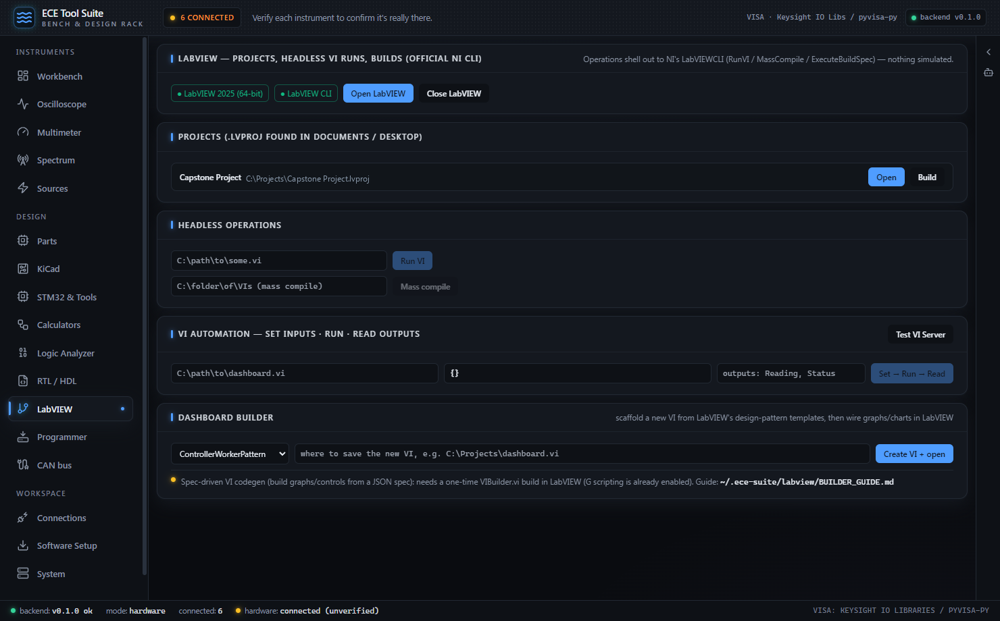
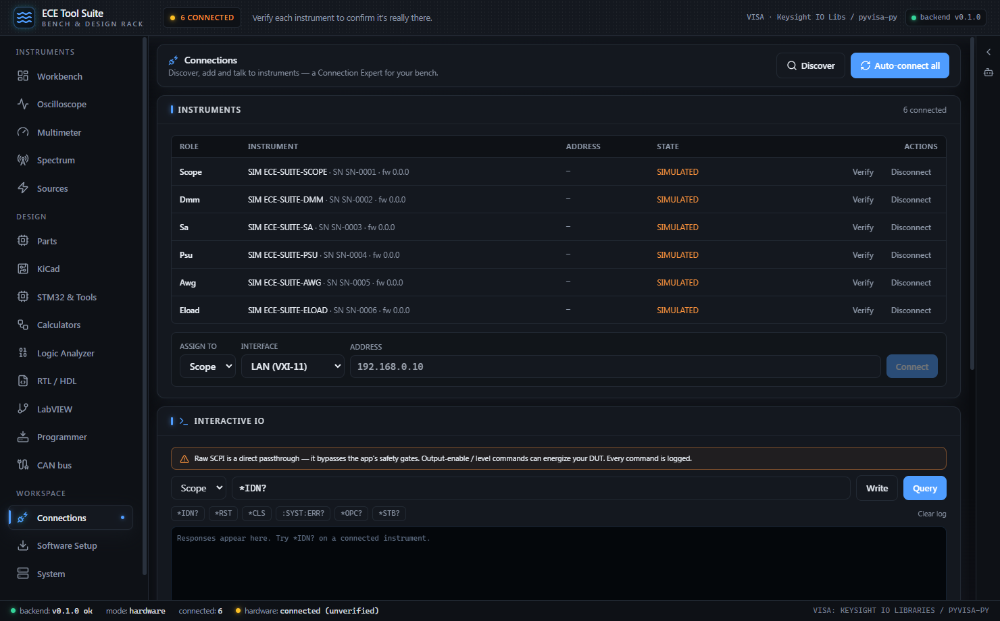
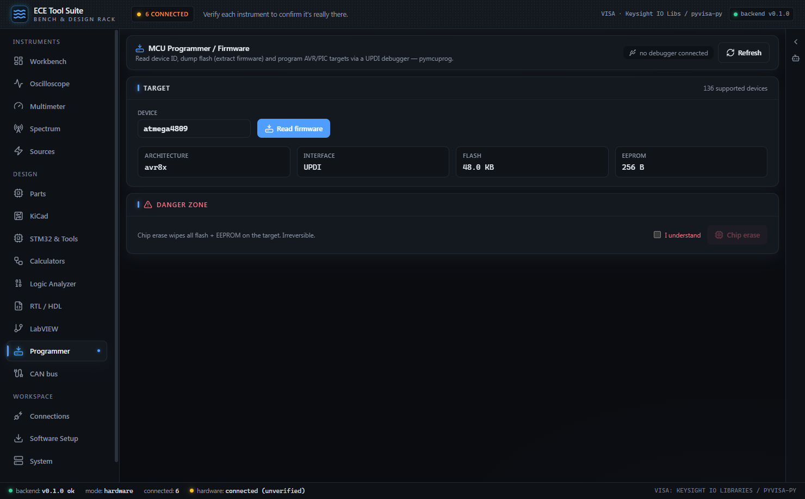

# LabVIEW, Software Setup, Assistant & MCP

[← RTL / HDL & FPGA](05-rtl-fpga.md) · [Index](01-getting-started.md) · [Development, Testing & Packaging →](07-build-test-package.md)

This section covers the four "glue" surfaces of the suite: driving NI LabVIEW headlessly, acquiring third-party tools with one click, talking to the in-app Claude assistant, and exposing the whole bench to external AI agents over MCP. It closes with the pymcuprog-based Programmer tab and the offline Logic/CAN decoders that several of these surfaces call into.

### LabVIEW tab

`backend/ece_suite/labview.py` integrates LabVIEW through **NI's official automation channel only**: `LabVIEWCLI.exe`. Nothing is simulated: detection globs the real National Instruments install tree, project listing scans your actual `Documents` and `Desktop` folders for `.lvproj` files, and every operation shells out to the CLI.


*LabVIEW tab with both detection chips green (LabVIEW 2025 64-bit and LabVIEW CLI), a discovered `.lvproj` project with its Open and Build buttons, and the headless Run VI / Mass compile inputs still showing their placeholder paths. Below that: VI Server automation, and the Dashboard Builder with its one-time VIBuilder.vi prerequisite spelled out.*

#### Detection

```python
def _installs() -> list[dict]:
    out = []
    for base in (r"C:\Program Files\National Instruments", r"C:\Program Files (x86)\National Instruments"):
        for d in sorted(glob.glob(os.path.join(base, "LabVIEW *"))):
            exe = os.path.join(d, "LabVIEW.exe")
            if os.path.exists(exe):
                m = re.search(r"LabVIEW (\S+)$", d)
                out.append({"version": m.group(1) if m else os.path.basename(d),
                            "path": exe, "bitness": "32-bit" if "(x86)" in base else "64-bit"})
    return out
```
*`backend/ece_suite/labview.py`*

Enumerates every `LabVIEW <version>` directory in both Program Files trees and only counts a hit if `LabVIEW.exe` actually exists inside. `status()` picks the last (newest) install as the default and separately checks for `LabVIEWCLI.exe` under `National Instruments\Shared\LabVIEW CLI`. The UI shows both as independent chips, because you can have LabVIEW installed but the CLI component missing, and the tab tells you exactly that ("install via NI Package Manager") instead of failing cryptically later.

#### Operations

Every headless operation funnels through one runner:

```python
def _run_cli(args: list[str], timeout: float) -> dict:
    cli = _cli()
    if not cli:
        return {"ok": False, "error": "LabVIEWCLI not installed", "install": DOWNLOAD_URL}
    st = status()
    cmd = [cli, *args, "-LogToConsole", "true"]
    if st["default"]:
        cmd += ["-LabVIEWPath", st["default"]]
    try:
        cp = subprocess.run(cmd, capture_output=True, text=True, timeout=timeout,
                            encoding="utf-8", errors="replace")
    except subprocess.TimeoutExpired:
        return {"ok": False, "error": f"LabVIEWCLI timed out after {timeout:.0f}s"}
    log = (cp.stdout or "") + ("\n" + cp.stderr if (cp.stderr or "").strip() else "")
    return {"ok": cp.returncode == 0, "returncode": cp.returncode,
            "log": log.strip()[-4000:]}
```
*`backend/ece_suite/labview.py`*

Builds the `LabVIEWCLI.exe` command with `-LogToConsole true` so NI's own log ends up captured, pins `-LabVIEWPath` to the newest detected install, and returns the last 4000 characters of the merged stdout/stderr log. The frontend renders that log verbatim in a `<pre>` block, so build failures read exactly as NI reports them.

| Operation | Endpoint | CLI operation | Input validation | Default timeout |
|---|---|---|---|---|
| Run VI | `POST /api/labview/run-vi` | `RunVI -VIPath …` | must be an existing `.vi` file | 300 s |
| Mass compile | `POST /api/labview/mass-compile` | `MassCompile -DirectoryToCompile …` | must be an existing directory | 900 s |
| Build spec | `POST /api/labview/build` | `ExecuteBuildSpec -ProjectPath … -TargetName …` (target defaults to `My Computer`; `-BuildSpecName` optional) | must be an existing `.lvproj` | 1800 s |
| Close LabVIEW | `POST /api/labview/close` | `CloseLabVIEW` | n/a | 60 s |
| Launch (GUI) | `POST /api/labview/launch` | none; `os.startfile()` on the `.lvproj` or `LabVIEW.exe` | LabVIEW must be installed | n/a |
| Status | `GET /api/labview/status` | none; detection only | n/a | n/a |
| Projects | `GET /api/labview/projects` | none; filesystem scan | n/a | n/a |

Project discovery (`list_projects`) globs `*.lvproj` up to three directory levels deep under `Documents` and `Desktop`, deduplicates by resolved path, and sorts newest-modified first. The tab lists the top 12 with per-project **Open** (GUI launch) and **Build** buttons; Build is disabled unless the CLI is present, Open only needs LabVIEW itself.

> **Requires:** LabVIEW (any detected version) for GUI launch; the separate **LabVIEW CLI** component (installed through NI Package Manager) for Run VI / Mass compile / Build / Close. With neither present the tab shows an honest "not installed" state and a button to NI's official download page. `run-vi`, `mass-compile`, `build`, and `launch` are all audit-logged.

Spec-driven VI generation is a separate, optional path: it needs a `VIBuilder.vi` helper that you build once inside LabVIEW yourself. The suite looks for it in the directory named by `ECE_SUITE_LABVIEW_DIR`, defaulting to `~/.ece-suite/labview`, and reports an honest "not built yet" error until it is there.

### Software Setup tab: one-click tool acquisition

`backend/ece_suite/setup_tools.py` maintains a catalog of every third-party tool the suite can use, split into two honest classes:

* **`auto`**: freely redistributed software the backend can install itself, either from the project's **official GitHub releases** (OSS CAD Suite, GHDL, Verible) or via a **pinned winget package ID** (LTspice `ADI.LTspice`, KiCad `KiCad.KiCad`), which is the vendor's own silent-install channel.
* **`page`**: login/EULA-gated vendors. One click opens the **official download page** plus a what-to-do note. No vendor authentication is ever bypassed.


*Software Setup tab with the catalog populated. The HDL / FPGA toolchain group (OSS CAD Suite, GHDL, Verible) and the Simulation / EDA group (LTspice, KiCad 9) each show a green `installed` badge, the approximate download size, the source the tool came from, and the path detection found; the Instruments / VISA group begins below the fold.*

| Tool | Kind | Group | Source |
|---|---|---|---|
| OSS CAD Suite (~320 MB) | auto | HDL / FPGA toolchain | GitHub `YosysHQ/oss-cad-suite-build` releases (self-extracting exe) |
| GHDL (~23 MB) | auto | HDL / FPGA toolchain | GitHub `ghdl/ghdl` releases (zip → isolated `ghdl/` subdir) |
| Verible (~7 MB) | auto | HDL / FPGA toolchain | GitHub `chipsalliance/verible` releases (zip → `bin/` exes) |
| LTspice (~400 MB) | auto | Simulation / EDA | winget `ADI.LTspice` |
| KiCad 9 (~1.2 GB) | auto | Simulation / EDA | winget `KiCad.KiCad` |
| Keysight IO Libraries Suite | page | Instruments / VISA | keysight.com (free login) |
| NI-VISA (alternative) | page | Instruments / VISA | ni.com (free login) |
| sigrok-cli | page | Instruments / VISA | sigrok.org official builds |
| STM32CubeCLT / STM32CubeMX | page | MCU / vendor tools | st.com (free login) |
| NI LabVIEW (+ LabVIEW CLI) | page | MCU / vendor tools | ni.com (free login) |
| AMD Vivado / Intel Quartus Lite / Lattice Radiant / Diamond | page | FPGA vendor tools | vendor sites (free accounts / licenses) |

Why the `page` class exists: Keysight, ST, NI, AMD, Intel and Lattice all put downloads behind an account login and click-through EULA. The suite refuses to automate around that. `start_install` on a `page` tool returns an error carrying the official URL, and the frontend opens that page instead:

```python
def start_install(tool_id: str) -> dict:
    entry = next((e for e in _catalog() if e["id"] == tool_id), None)
    if entry is None:
        return {"ok": False, "error": f"unknown tool {tool_id!r}"}
    if entry["kind"] != "auto":
        return {"ok": False, "error": "this tool is login/EULA-gated — use its official page",
                "url": entry["url"]}
    with _LOCK:
        th = _THREADS.get(tool_id)
        if th and th.is_alive():
            return {"ok": True, "already_running": True}
    _set(tool_id, state="starting", progress=0, detail="", error=None, finished=False)
    t = threading.Thread(target=_run_install, args=(tool_id, entry), daemon=True)
    _THREADS[tool_id] = t
    t.start()
    return {"ok": True, "started": True}
```
*`backend/ece_suite/setup_tools.py`*

Each install is user-initiated, per tool, per click. `page` tools are structurally excluded from automation, a re-click while a thread is alive is a no-op, and the actual work runs on a daemon thread so the FastAPI server (and the rest of the app) stays responsive.

#### The install state machine, end to end

An install walks `starting → downloading → extracting → verifying → done` (or `error`), tracked in a lock-protected status registry that `GET /api/setup/status` exposes. `SetupTab.tsx` polls it every 1.2 s while anything is active, renders a live progress bar during `downloading` (byte-accurate: `"downloading 118 / 320 MB"` from the streamed `content-length`), and re-fetches the catalog the moment a state flips to `finished`, so the green "installed" dot only appears when detection agrees.

The critical last step is **verification-after-install**:

```python
        where = fn(tool_id, recipe)
        # verification: the same detection the app trusts, never an assumption
        _set(tool_id, state="verifying", detail="re-running tool detection")
        rtl._ENV_CACHE = None            # env cache may predate the new install locations
        ok, path = _installed(tool_id)
        if not ok:
            raise RuntimeError("installed files present but detection still reports missing "
                               f"(looked at {where})")
        _set(tool_id, state="done", progress=100, finished=True,
             detail=f"installed + verified in {time.monotonic() - t0:.0f}s → {path or where}")
```
*`backend/ece_suite/setup_tools.py` (`_run_install`)*

After the recipe finishes, the installer invalidates the RTL environment cache and re-runs `_installed()`, which is not a bespoke check but a dispatch into **the same detectors the rest of the app uses** (`rtl.toolchain()` capabilities for the HDL tools, `design_tools.detect_tools()` for LTspice/KiCad/Cube*, `io_env.visa_backends()` for VISA, `labview.status()` for LabVIEW). If the files landed but detection still says missing, the install is reported as a failure. "Done" is never assumed.

#### Guardrails

* **Host allowlist.** Downloads are refused outright unless the URL's hostname is in `ALLOWED_HOSTS` (`github.com`, `api.github.com`, `objects.githubusercontent.com`, `release-assets.githubusercontent.com`, `codeload.github.com`). `_check_host` runs on both the GitHub API call and the asset URL.
* **Zip-slip defense.** `_safe_extract` scans every archive member and raises if any path is absolute or contains `..` before `extractall` runs.
* **Winget honesty.** Winget recipes run the vendor package with `--silent --disable-interactivity`; if `winget` (App Installer) isn't on PATH, the catalog flags `needs_winget` and the UI disables the Install button with a pointer to the official page. A UAC prompt may still appear; that's Windows, not the suite.
* **Isolation where it matters.** GHDL extracts into its own `ghdl/` subdirectory because it ships its own MinGW DLLs that must not collide with the OSS CAD Suite's (Windows resolves DLLs from the exe's own directory first).
* **Auditing.** Every `POST /api/setup/install/{tool_id}` is recorded in the audit log.

| Endpoint | Method | Purpose |
|---|---|---|
| `/api/setup/catalog` | GET | Full catalog with live `installed`/`path`/`one_click`/`needs_winget` per tool |
| `/api/setup/install/{tool_id}` | POST | Start a one-click install (auto tools) or return the official URL (page tools) |
| `/api/setup/status` | GET | Per-tool install state machine: `state`, `progress`, `detail`, `error`, `finished` |

### Claude assistant (Layer A): the in-app chatbox

`backend/ece_suite/assistant.py` runs a streaming agent loop on the Anthropic SDK, wired to the suite's shared tool registry. The frontend is `AssistantDrawer.tsx`, a right-hand drawer connected over `WS /ws/chat`; server-side history is kept per WebSocket session so follow-up questions have context.

The system prompt encodes the suite's two non-negotiables, provenance honesty and the human-confirm gate:

```python
SYSTEM_PROMPT = (
    "You are the in-app assistant for an electrical engineer's bench tool suite "
    "(oscilloscope, DMM, spectrum analyzer, power supply). You can call tools to read "
    "instruments and run analyses.\n\n"
    "CRITICAL — PROVENANCE: every tool result includes a `_provenance` field that is one of "
    "SIMULATED, UNVERIFIED_HW, or VERIFIED_HW. You MUST relay this honestly. If a value is "
    "SIMULATED, say so plainly — it is NOT a real measurement, there is no hardware "
    "connected. Never present a simulated or unverified value as a confirmed measurement.\n\n"
    "SAFETY: you may describe source/load (power-supply) presets, but you cannot energize "
    "anything yourself — those require the user to confirm in the UI. If a tool returns a "
    "'requires explicit human confirmation' error, tell the user to use the preset's confirm "
    "control; do not retry.\n\n"
    "Be concise and quantitative, like a good lab partner."
)
```
*`backend/ece_suite/assistant.py`*

Provenance isn't just prompt engineering: every tool result the model receives carries a `_provenance` tag injected by the registry, so the model is *structurally* shown what's real and what isn't. The drawer surfaces the same tag on a chip under each assistant message (`scope_measure · VERIFIED_HW`), so you can audit the model's claims without trusting its prose.

The loop streams up to `max_hops = 8` model turns. Events sent over the WebSocket are `text` (token deltas), `tool_use`, `tool_result` (with provenance or error), `turn_end`, and `error`. The model defaults to `claude-sonnet-4-6` (override with the `ECE_SUITE_MODEL` env var) and needs `ANTHROPIC_API_KEY` in the backend environment. Without it, `GET /api/assistant/status` reports unavailable and the drawer shows a setup hint instead of a broken chatbox.

#### What the assistant cannot do: self-confirm an energize

The enforcement lives in the registry, not the prompt:

```python
    def call(self, name: str, args: dict, *, surface: Surface, human_confirmed: bool = False) -> dict:
        ...
        if spec.confirm_required and not human_confirmed:
            # The assistant can SEE a confirm-required tool (so it can guide the user) but
            # may never self-confirm it. Only a human action sets human_confirmed=True.
            raise PermissionError(
                f"tool {name!r} requires explicit human confirmation; the assistant "
                "cannot self-confirm an energize/source operation")
```
*`backend/ece_suite/registry.py`*

The chatbox surface (`Surface.CHATBOX`) can *see* source-control tools, so it can explain what a preset would configure, but the registry refuses to execute any `confirm_required` tool unless `human_confirmed=True`, and only a real UI action ever sets that flag. The assistant has no code path to energize your DUT; if it tries, the drawer shows the tool chip as `· blocked` and the model is told to point you at the confirm control.

Summary of the split:

| Assistant **can** | Assistant **cannot** |
|---|---|
| Read scope/DMM/SA measurements (provenance-tagged) | Energize a PSU/e-load output or fire a safety-gated preset |
| Run analyses, decoders, and design calculators | Self-confirm any `confirm_required` tool |
| Describe what a source preset would configure | Present simulated data as a real measurement (results carry `_provenance`) |
| Guide you to the UI confirm control | Retry a blocked energize |

### Layer B: Claude Code + MCP agent bridge

`backend/ece_suite/mcp_bridge.py` exposes the app's tools to an autonomous Claude agent through an in-process MCP server, but only the **AUTONOMOUS** surface. That surface excludes every `SOURCE_CONTROL` tool *and* every `confirm_required` tool at the visibility level (`ToolSpec.visible_to`), so unlike the chatbox the autonomous agent doesn't even see them. It physically cannot energize a DUT; the tools aren't in its world.

```python
def status(registry: ToolRegistry) -> dict:
    cli = shutil.which("claude")
    key = bool(os.environ.get("ANTHROPIC_API_KEY"))
    sdk = sdk_installed()
    return {
        "sdk_installed": sdk,
        "claude_cli": cli,
        "api_key": key,
        "ready": bool(sdk and cli and key),
        "exposed_tools": [s["name"] for s in autonomous_tool_specs(registry)],
        "note": "Agent runs use the AUTONOMOUS (read-only) surface; source/energize tools are never exposed.",
    }
```
*`backend/ece_suite/mcp_bridge.py`*

Three prerequisites gate live agent runs: the `claude-agent-sdk` Python package, the `claude` CLI (the SDK's transport; `npm i -g @anthropic-ai/claude-code`), and an API key. The bridge reports each independently and refuses `run_agent_task` until all three are green, listing exactly what's missing.

The UI is the **AgentPanel** card inside the System tab: three readiness chips (Agent SDK / claude CLI / API key), the list of exposed read-only tools, a prompt box, and a Run button that calls `POST /api/agent/run` (capped at 4 agent turns by default).

| Endpoint | Method | Purpose |
|---|---|---|
| `/api/assistant/status` | GET | Layer A availability + model id |
| `/ws/chat` | WS | Layer A streaming chat (per-session history) |
| `/api/agent/status` | GET | Layer B readiness + exposed tool names |
| `/api/agent/run` | POST | Run one autonomous agent task over the AUTONOMOUS surface |

### Standalone MCP server: wiring the bench into Claude Desktop / Claude Code

`backend/ece_suite/mcp_server.py` is a thin **stdio** MCP server (FastMCP) that any MCP client can launch. It does not touch instruments itself. Every tool is an HTTP call to the running app's REST backend on `http://127.0.0.1:8848`, so instruments stay owned by the app: one connection lock, one audit log, the same safety posture. If the app isn't running, every tool returns an honest "cannot reach the ECE Tool Suite … Is the app running?" error instead of hanging.

**Don't hand-write the client config.** `GET /api/mcp/info` builds a ready-to-paste JSON block from the *actual* interpreter path (`sys.executable`) and port, and the Connections tab renders it:

```python
    port = int(os.environ.get("ECE_SUITE_PORT", 8848))
    url = f"http://127.0.0.1:{port}"
    python = sys.executable
    ...
    config = {"mcpServers": {"ece-tool-suite": {
        "command": python, "args": ["-m", "ece_suite.mcp_server"], "env": {"ECE_SUITE_URL": url}}}}
    return {
        "available": available, "server_name": "ece-tool-suite",
        "command": python, "args": ["-m", "ece_suite.mcp_server"], "url": url, "tools": tools,
        "config_json": json.dumps(config, indent=2),
        "note": "Keep the app running, then add this to your MCP client. Claude can then list "
                "instruments, auto-connect, measure, send SCPI and run calculators on your bench.",
    }
```
*`backend/ece_suite/main.py` (`/api/mcp/info`)*

In a dev checkout the `command` resolves to `<path-to-your-clone>\backend\.venv\Scripts\python.exe`; in a packaged install it's `<install-dir>\backend\runtime\python.exe`. Because the config is generated from the running process, it's always correct for *your* machine. Paste the `config_json` into Claude Desktop's `claude_desktop_config.json` (under `mcpServers`) or add it to Claude Code with `claude mcp add`. Keep the app running: the sidecar must be up before the agent connects. [`docs/mcp.md`](../mcp.md) walks through the client wiring in full.


*Connections tab with all six roles bound. Each row carries its identity string, serial and firmware, its state, and per-role Verify and Disconnect actions. The manual assign row is set to LAN (VXI-11), and the Interactive IO console below carries the raw-SCPI passthrough warning with its `*IDN?` shortcut buttons. The generated MCP client config sits further down the page, out of frame.*

Tools the MCP server exposes:

| MCP tool | Backs onto | Notes |
|---|---|---|
| `list_instruments` | `GET /health` | Connected bench instruments with vendor/model/provenance |
| `io_environment` | `GET /api/io/environment` | What's plugged in + VISA drivability + install hints |
| `autoconnect` | `POST /api/io/autoconnect` | Discover + assign roles; `lan=True` adds mDNS/LXI sweep |
| `scope_measure` / `dmm_read` / `spectrum_peak` | scope/DMM/SA endpoints | Real measurements from connected gear |
| `scpi` | `POST /api/io/scpi` | Raw SCPI query/write to any role; **see warning below** |
| `list_calculators` / `run_calculator` | `/api/calc` | Built-in EE design calculators |
| `detect_design_tools` | `GET /api/tools/detect` | Installed EDA/MCU tools with paths |
| `parse_cubemx_ioc` | `POST /api/ioc/parse` | STM32CubeMX `.ioc` → MCU, pins, timers |
| `power_stage` / `power_design` / `power_verify` / `power_loop_verify` | `/api/power/*`, `/api/spice/verify` | Sizing, WEBENCH-class design, SPICE + loop-stability verification |
| `magnetics_advise` / `capacitor_bank` | `/api/power/*` | Core/winding search, cap-bank sizing |
| `mcu_status` / `mcu_device_info` / `mcu_read_firmware` | `/api/mcu/*` | pymcuprog-backed (see Programmer below) |
| `decode_logic` | `POST /api/logic/decode` | SPI / I²C / UART decode of captured channels |

> **Warning: `scpi` with `write=True` bypasses the app's safety gates.** A raw `OUTP ON` or level command can energize your DUT. This is the documented, deliberate escape hatch for an external agent under *your* supervision; every command is audit-logged. The docstring says exactly this to the model, so a well-behaved agent will warn you too, but the gate here is you.

### Programmer, Logic & CAN: the tools these surfaces call

**Programmer tab** (`backend/ece_suite/programmer.py`) embeds Microchip's **pymcuprog** natively: it drives a UPDI/PDI/debugWIRE debugger (Curiosity Nano, Atmel-ICE, MPLAB SNAP, PICkit) to read a target's device ID, supply voltage, and flash, returning a firmware dump as Intel-HEX plus base64 raw bytes. Hardware-first: with no debugger attached, discovery returns an empty list and reads error honestly; the device catalog and `device_info` work offline (metadata only). The destructive operations follow the same confirm discipline as everything else:

```python
def chip_erase(device: str, tool_serial: str | None, confirm: bool = False) -> dict:
    """Full chip erase — DESTRUCTIVE. Requires confirm=True."""
    if not confirm:
        return {"ok": False, "error": "chip erase requires confirm=true (this wipes the target)"}
```
*`backend/ece_suite/programmer.py`*

Reads are free; `chip_erase` and `write_hex` refuse to run without an explicit `confirm=True`. Note the standalone MCP server exposes only the *read* side (`mcu_status`, `mcu_device_info`, `mcu_read_firmware`): an external agent can dump firmware off a wired-up target but has no MCP tool to erase or reflash it.


*Programmer tab in its disconnected state. The chip reads `no debugger connected`, yet the offline catalog (136 supported devices) still resolves `atmega4809` from metadata alone: avr8x, UPDI, 48.0 KB flash, 256 B EEPROM. No firmware has been read, and the Danger Zone chip-erase button stays disabled behind its "I understand" checkbox.*

**Logic decoders** (`backend/ece_suite/logic_decode.py`) are pure functions over per-sample digital channels (lists of 0/1 at a fixed sample rate) implementing SPI, I²C and UART, including UART parity/framing-error detection. Because they take plain sample arrays, they work on data from any source: a Saleae, a sigrok/FX2 analyzer, an MSO scope's digital pod, or an imported CSV/VCD. Matching signal *generators* produce known waveforms so decoding is verifiable in tests without hardware. This is what the `decode_logic` MCP tool calls.

**CAN decoder** (`backend/ece_suite/can_decode.py`) is a minimal offline DBC pipeline: parse `BO_`/`SG_` lines from a DBC file, then decode logged frames into physical engineering values (scale/offset/unit), with Intel byte order fully supported and Motorola via the standard sawtooth. No hardware and no `python-can` needed; it ports the offline path of the CSS-Electronics CAN reverse-engineering workflow.

---
[← RTL / HDL & FPGA](05-rtl-fpga.md) · [Development, Testing & Packaging →](07-build-test-package.md)
